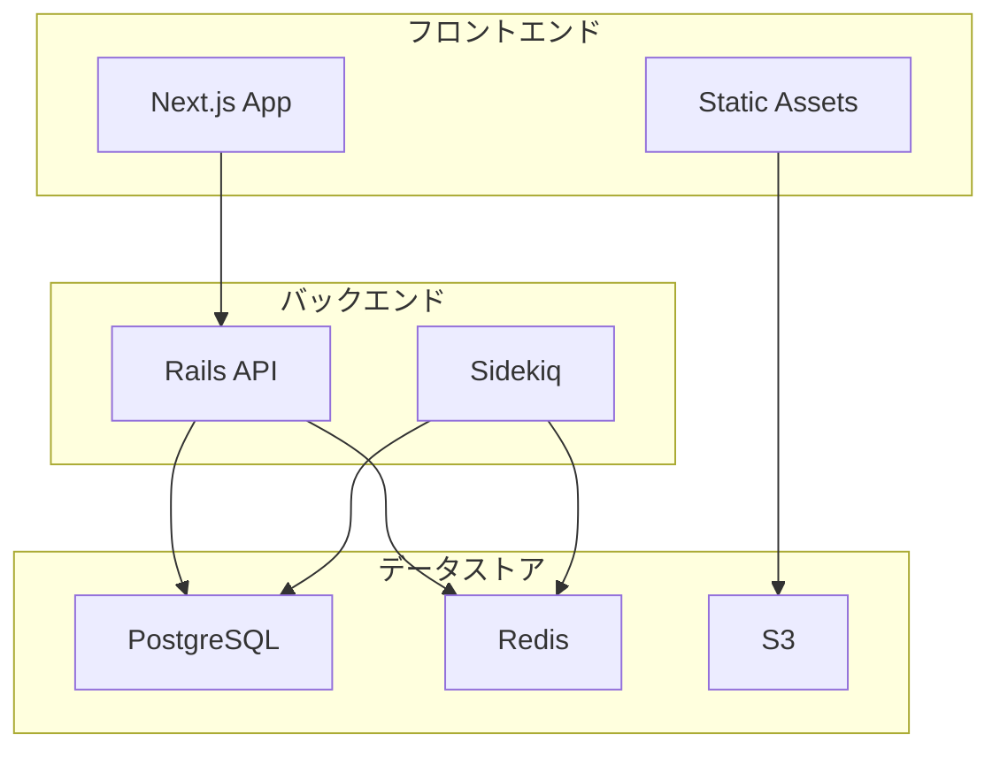
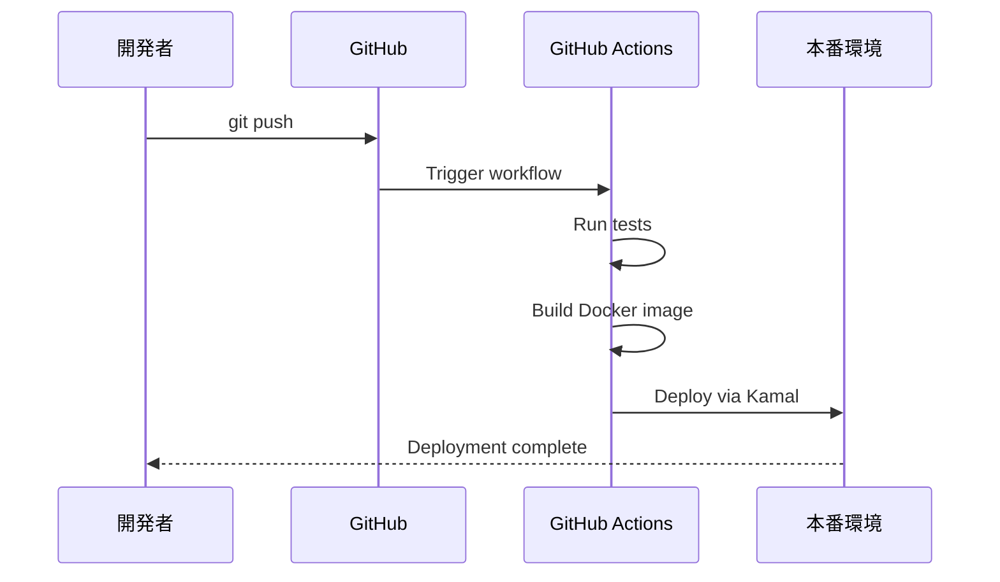

# カスタムMarkdownコンポーネント活用例

## リンクカードの活用例

### 参考資料の表示
```markdown
Rails 7.2の新機能については、公式ブログを参照してください：

https://rubyonrails.org/blog/2024/8/9/Rails-7-2-0-has-been-released

詳細なAPIドキュメントはこちら：

https://api.rubyonrails.org/v7.2/
```

### 関連記事への誘導
```markdown
この実装手法の詳細は、以下の記事でも解説しています：

https://takeyuweb.co.jp/articles/rails-engine-tailwindcss

GitHubのサンプルリポジトリ：

https://github.com/takeyuweb/rails-engine-example
```

## 詳細ブロックの活用例

### 環境別の設定方法
```markdown
## インストール方法

基本的なインストール方法は以下の通りです：

```bash
gem install kamal
```

:::details Dockerコンテナ内で使用する場合
Dockerfileに以下を追加：

```dockerfile
RUN gem install kamal
```

docker-compose.ymlでの設定：

```yaml
services:
  app:
    environment:
      - KAMAL_VERSION=2.0
```
:::

:::details Railsプロジェクトに追加する場合
Gemfileに追加：

```ruby
group :development do
  gem 'kamal'
end
```

その後、bundle installを実行：

```bash
bundle install
```
:::
```

### トラブルシューティング
```markdown
## よくある問題と解決方法

:::details エラー: "Permission denied"が発生する場合
このエラーは権限不足が原因です。以下の対処法を試してください：

1. sudoを使用して実行
   ```bash
   sudo kamal deploy
   ```

2. ユーザーをdockerグループに追加
   ```bash
   sudo usermod -aG docker $USER
   ```

3. SSHキーの権限を確認
   ```bash
   chmod 600 ~/.ssh/id_rsa
   ```
:::

:::details デプロイが遅い場合の最適化方法
以下の設定で高速化できます：

1. ビルドキャッシュの活用
2. マルチステージビルドの使用
3. 並列デプロイの設定

詳細な設定方法は...
:::
```

## メッセージブロックの活用例

### 重要なポイントの強調
```markdown
## セキュリティ設定

環境変数の設定は以下のように行います：

```yaml
env:
  SECRET_KEY_BASE: <%= ENV['SECRET_KEY_BASE'] %>
```

:::message
本番環境では必ず強力なシークレットキーを設定してください。
`rails secret`コマンドで生成できます。
:::
```

### Tipsの提供
```markdown
## パフォーマンス最適化

:::message
Rails 7.2では、自動的にSQLクエリの最適化が行われるようになりました。
特に、N+1問題の検出と警告機能が強化されています。
:::

開発環境で以下の設定を有効にすることをお勧めします：
```

## アラートブロックの活用例

### セキュリティ警告
```markdown
## データベース接続設定

:::message alert
パスワードを設定ファイルに直接記述しないでください！
必ず環境変数やcredentialsを使用してください。
:::

正しい設定方法：
```yaml
production:
  password: <%= ENV['DATABASE_PASSWORD'] %>
```
```

### 破壊的変更の警告
```markdown
## マイグレーション実行

:::message alert
このマイグレーションは既存データを削除します。
実行前に必ずバックアップを取得してください。
:::

```bash
rails db:migrate RAILS_ENV=production
```
```

## Mermaid図表の活用例

### システムアーキテクチャ
````markdown
## システム構成

現在のアプリケーションは以下のような構成で動作しています：


````

### デプロイフロー
````markdown
## CI/CDパイプライン


````

## 画像表示の活用例

### スクリーンショットとキャプション
```markdown
## 管理画面の使い方

ダッシュボードから各種設定にアクセスできます：


*図1: 管理画面ダッシュボード - 各種メトリクスが一覧表示される*

ユーザー管理画面では詳細な権限設定が可能です：


*図2: ユーザー管理画面 - ロール別の権限設定*
```

### 比較画像
```markdown
## パフォーマンス改善結果

最適化前後の比較：


*改善前: 平均レスポンスタイム 2.5秒*


*改善後: 平均レスポンスタイム 0.3秒*
```

## 組み合わせた活用例

### 技術記事での総合的な活用
```markdown
# Rails EngineでTailwindCSSを使う方法

## 概要

Rails EngineでTailwindCSSを導入する際の課題と解決方法を解説します。

公式ドキュメント：

https://tailwindcss.com/docs/guides/ruby-on-rails

## 実装手順

### 1. 基本設定

```ruby
# engine.rb
require "tailwindcss-rails"
```

:::message
Rails 7以降では、importmap-railsとの互換性に注意が必要です。
:::

### 2. アセットパイプラインの設定

:::details 開発環境での設定
```ruby
config.assets.paths << root.join("app/assets/stylesheets")
config.assets.precompile += %w[ engine_name/application.css ]
```

開発時は以下のコマンドでTailwindをウォッチモードで起動：

```bash
bin/rails tailwindcss:watch
```
:::

### 3. 本番環境での注意点

:::message alert
本番環境では必ずアセットのプリコンパイルを実行してください：
```bash
RAILS_ENV=production bin/rails assets:precompile
```
:::

## トラブルシューティング

:::details CSSが反映されない場合

1. キャッシュのクリア
   ```bash
   bin/rails tmp:clear
   ```

2. Tailwindの再ビルド
   ```bash
   bin/rails tailwindcss:build
   ```

3. それでも解決しない場合は、以下を確認：
   - `config/tailwind.config.js`の`content`設定
   - `app/assets/config/manifest.js`の記述
:::

## まとめ

Rails EngineでのTailwindCSS導入は、いくつかの注意点がありますが、
適切に設定すれば問題なく動作します。

サンプルコード：

https://github.com/takeyuweb/rails-engine-tailwindcss-example
```

## 使い分けのガイドライン

### リンクカード
- 外部リソースへの参照
- 関連記事への誘導
- 公式ドキュメントへのリンク

### 詳細ブロック
- オプション設定の説明
- 環境別の手順
- 補足情報
- 長いコード例

### メッセージブロック
- 重要なポイント
- Tips・ベストプラクティス
- 推奨事項

### アラートブロック
- セキュリティ警告
- 破壊的操作の警告
- 重大な注意事項

### Mermaid図表
- システム構成図
- フローチャート
- シーケンス図
- 関係性の可視化

### 画像+キャプション
- スクリーンショット
- 比較画像
- 図表・グラフ
- UI/UXの説明