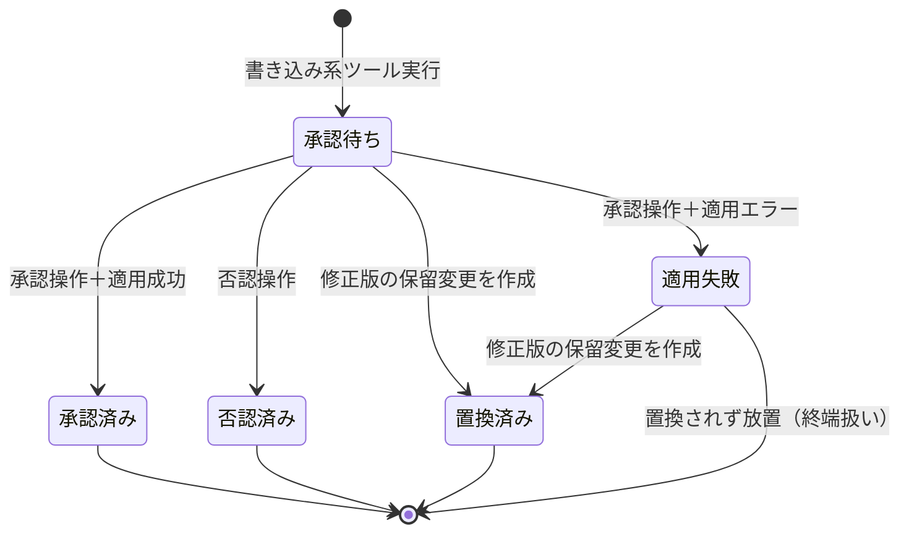

# 掲載内容管理支援エージェント 機能設計書

**機能名**: 掲載内容管理支援エージェント
**要件定義書**: [content_management_agent_requirements.md](../requirements/content_management_agent_requirements.md)

> **設計方針**
>
> 実装の詳細に影響されないコアドメインの設計を記載する。新規に作る部分は責務名で記述し、
> 既存コード・既存テーブルへの結合点のみ具体名で記載する。

## 1. 機能概要

### 1.1 目的

管理画面のチャット UI で、AI エージェントとの対話により掲載内容（Project / SpeakingEngagement / UsesItem / Slide）を登録・更新できるようにする。書き込みは保留変更と明示承認のゲートを必ず通す。

### 1.2 主要機能

1. **会話管理**: 会話の開始・一覧・再開。履歴（発言・ツール実行・トークン量）の永続化
2. **エージェント応答生成**: ツール実行ループを含む応答の生成とストリーミング配信
3. **素材収集**: URL 取得・Web 検索（Brave Search API）による属性抽出の素材収集
4. **承認ゲート**: 書き込み提案を保留変更として記録し、プレビュー承認後にのみ掲載内容へ適用
5. **コスト表示**: 会話ごとの LLM 利用コスト概算の算出・表示

### 1.3 処理フロー概要

#### 1.3.1 発言から応答まで

1. 管理者が会話画面で発言を送信する
2. 発言を会話履歴に保存し、応答生成ジョブを投入して、画面には発言を即時反映する
3. 応答生成ジョブが会話進行エージェントを実行する。エージェントは必要に応じてツール（読み取り系・外部取得系・書き込み系）を呼び出しながら応答を生成する
4. 生成中のテキスト断片はチャット画面へ逐次配信（ストリーミング表示）される
5. 応答完了時、メッセージとトークン量を確定保存し、会話のコスト表示を更新する

#### 1.3.2 書き込みの承認フロー

6. エージェントが書き込み系ツールを呼ぶと、掲載内容は変更されず保留変更が作成される
7. チャット画面に保留変更のプレビュー（変更内容・新規作成時は公開状態を含む）が承認・否認の操作とともに表示される
8. 管理者の操作により分岐する：
   - **承認**: 適用処理が保留変更の内容をそのまま掲載内容へ反映する。適用結果はエージェントへ通知され、完了報告の応答が生成される
   - **否認**: 保留変更を否認済みにし、掲載内容は変更しない
   - **修正指示**（発言として送信）: エージェントが修正版の保留変更を新規作成し、旧保留変更は置換済みにする
9. 適用時にバリデーションエラーが発生した場合、保留変更を適用失敗として記録し、エラー内容を会話に戻す。エージェントは管理者に確認のうえ修正版の保留変更を再提案する（再承認必須）

## 2. 設計判断

### 2.1 採用した実装パターン

比較検討・却下案は ADR 側（ADR 管理サーバー、案件 spotlight-rails）に集約している。

| # | 判断ポイント | 採用案 | 関連ADR |
|---|------------|-------|--------|
| 1 | LLM プロバイダ | さくらのAI Engine（OpenAI 互換 API、タスク別モデル使い分け） | SPOTLIGHT-RAILS-29 |
| 2 | エージェント実装基盤 | ruby_llm（RubyLLM::Agent、acts_as_chat 永続化） | SPOTLIGHT-RAILS-30 |
| 3 | 書き込み承認の保証方式 | 保留変更エンティティ＋明示承認操作（ツールは掲載内容を直接変更しない） | SPOTLIGHT-RAILS-31 |
| 4 | 応答生成の実行方式 | バックグラウンドジョブ＋Turbo Streams 配信（Solid Queue 稼働化） | SPOTLIGHT-RAILS-32 |
| 5 | エージェント用ツールの実装形態 | RubyLLM::Tool 新設・モデル層直接呼び出し（既存 MCP ツールと並存） | SPOTLIGHT-RAILS-33 |

### 2.2 結合評価サマリ

| # | 起点 → 終点 | 強さ | 距離 | 均衡 | 備考 |
|---|-----------|------|------|------|------|
| 1 | エージェント用ツール → 既存掲載モデル（Project, SpeakingEngagement, UsesItem, Slide, Tag） | Model(2) | 同一コンテキスト(2) | OK | 既存モデルの公開 API（バリデーション・`Slide.import_from_markdown`）を利用 |
| 2 | 保留変更の変更内容 → 掲載モデルの属性構造 | Contract(3) | 同一コンテキスト(2) | 許容 | 変更内容を構造化データで保持するため属性名に緩く結合。適用時バリデーションで検出可能なため許容（SPOTLIGHT-RAILS-31 のトレードオフ） |
| 3 | 会話履歴 → ruby_llm の acts_as_chat スキーマ | Contract(3) | 異システム(4)（外部 gem 契約） | OK | gem 標準ジェネレータのスキーマに従う |
| 4 | コスト算出 → さくらのAI Engine 公表単価 | Contract(3) | 異システム(4) | OK | 単価は静的設定に隔離し、改定時はそこだけ更新（要件 5.2） |
| 5 | 外部取得系ツール → さくらのAI Engine / Brave Search API | Integration(4) | 異システム(4) | OK | 外部 API 依存として不可避 |
| 6 | 応答生成ジョブ → チャット画面（Turbo Streams 配信） | Contract(3) | 同一コンテキスト(2) | 許容 | 配信対象の画面部品構造への結合。Hotwire の標準パターンとして許容 |

**許容している不均衡**: #2, #6（各備考のとおり）。
**設計改善の経緯**: 初期案では書き込みツールが掲載モデルを直接更新する構成（強さ Functional 相当）だったが、承認保証の要件から保留変更を挟む構成（SPOTLIGHT-RAILS-31）に変更し、ツールと掲載モデルの結合を弱めた。

## 3. データ要件

### 3.1 会話履歴（新規）

ruby_llm の Rails 統合（acts_as_chat）が定める標準スキーマに従い、会話・メッセージ・ツール呼び出し・モデルのテーブル群を新設する（テーブル構成・カラムの詳細は導入バージョンのジェネレータの現行構成に従う）。ここでは本機能が依存する項目のみ記す。

#### 3.1.1 会話

| 項目 | 必須 | 説明 |
|------|------|------|
| 使用モデル識別子 | ○ | 会話進行エージェントのモデル |
| タイトル | | 会話一覧表示用。最初の発言から自動設定（先頭の一定文字数） |
| 作成・更新日時 | ○ | 一覧の並び順（更新日時降順）に使用 |

#### 3.1.2 メッセージ

| 項目 | 必須 | 説明 |
|------|------|------|
| 会話への参照 | ○ | |
| 役割（管理者発言／エージェント応答／ツール結果等） | ○ | gem 標準の役割区分に従う |
| 本文 | | |
| 入力・出力トークン数 | | コスト算出に使用（応答完了時に API の usage 値を保存） |
| 使用モデルへの参照 | | メッセージ単位のコスト算出に使用（gem 標準ではモデルテーブルへの参照。単価表はモデル識別子で引く） |

#### 3.1.3 ツール呼び出し

gem 標準スキーマのまま使用する（ツール名・引数・対応メッセージ）。ツール実行記録は要件 4 章の「いつ・何を・どう更新したか」の記録を兼ねる。

#### 3.1.4 下位タスク利用量記録

**責務**: 会話進行の外で実行される下位タスク（属性抽出・検索結果要約。5.3 参照）の LLM 利用量を、会話のコスト概算に含めるために記録する。

| 項目 | 必須 | 説明 |
|------|------|------|
| 会話への参照 | ○ | どの会話の下位タスクか |
| タスク種別 | ○ | 属性抽出／検索結果要約 |
| 使用モデル識別子 | ○ | 単価表の参照キー |
| 入力・出力トークン数 | ○ | API の usage 値 |
| 実行日時 | ○ | |

### 3.2 保留変更（新規）

**責務**: 書き込み系ツールの提案内容を、承認されるまで掲載内容と隔離して保持する。

| 項目 | 必須 | 説明 |
|------|------|------|
| 会話への参照 | ○ | どの会話の提案か |
| 提案メッセージへの参照 | ○ | 作成契機となったエージェント応答。履歴領域での時系列配置に使用 |
| 対象種別 | ○ | Project / SpeakingEngagement / UsesItem / Slide のいずれか |
| 対象レコード識別子 | | 更新・公開切替の対象。新規作成時は空 |
| 操作種別 | ○ | 新規作成／更新／公開・非公開切替 |
| 変更内容 | ○ | 適用する属性の構造化データ（3.2.1 参照） |
| 状態 | ○ | 承認待ち／承認済み／否認済み／置換済み／適用失敗（既定: 承認待ち） |
| 適用日時 | | 承認済みへの遷移時に記録 |
| 適用エラー内容 | | 適用失敗時のバリデーションエラー等を記録 |

**状態遷移**:



- 承認操作が可能なのは「承認待ち」の保留変更のみ。それ以外の状態のプレビューは操作不能（結果表示のみ）にする
- 同一会話に「承認待ち」が複数並存してよい（複数レコードの一括登録を提案する場合）。承認は保留変更ごとに行う

#### 3.2.1 変更内容の形式（対象種別ごと）

| 対象種別 | 変更内容の形式 |
|---------|--------------|
| Project | 属性の名前と値の組（title, description, icon, color, technologies, published_at 等、既存カラムに対応） |
| SpeakingEngagement | 属性の組＋タグ名の一覧 |
| UsesItem | 属性の組（published 含む） |
| Slide | frontmatter 付き markdown 全文（適用は既存の `Slide.import_from_markdown` を使用）。公開状態は frontmatter の公開日時項目、タグは frontmatter のタグ項目で表現し、プレビュー表示時は markdown から抽出して示す。公開・非公開切替のみの場合は属性の組 |

### 3.3 静的設定（コード管理・テーブル不要）

| 設定 | 内容 |
|------|------|
| タスク別モデル割当 | タスク種別（会話進行／属性抽出／検索結果要約）→ さくらのAI Engine のモデル識別子。初期割当は 5.3 参照 |
| モデル単価表 | モデル識別子 → 入力・出力それぞれの円建て単価（さくらのAI Engine 公表単価）。改定時はここだけ更新 |

## 4. 計算ロジック

### 4.1 会話コスト概算

```
メッセージのコスト[円] = 入力トークン数 × 入力単価[円/トークン]
                        + 出力トークン数 × 出力単価[円/トークン]
（単価はメッセージの使用モデルの識別子で単価表を引く）
```

```
会話のコスト[円] = 全メッセージのコスト ＋ 全下位タスク利用量記録（3.1.4）のコスト
```

計算手順：
1. 応答完了時に API の usage からトークン数をメッセージ（下位タスクは利用量記録）へ保存する
2. 表示時に単価表を用いて合算する。**コストは保存せずトークン数からの導出値とする**（要件 2.1.1 の「コストの保存」はトークン量の保存＋導出で充足する意図的な設計。単価改定時に過去分を再計算するかは問わない＝要件 5.2 と整合）
3. 表示は円単位・小数第 2 位まで（それ未満は四捨五入）。内部の合算は丸めずに行う
4. 単価表にないモデルの分は「単価未設定」として合計から除外し、その旨を表示に含める

## 5. ビジネスルール

### 5.1 ツールの区分と実行条件

| 区分 | ツール（責務名） | 承認 | 掲載内容の変更 |
|------|----------------|------|--------------|
| 読み取り系 | 掲載内容の一覧（対象種別・絞り込み条件つき。キーワード部分一致を含み、要件の「検索」はこの絞り込みで実現する）／掲載内容の参照（対象種別・識別子） | 不要（自動実行） | しない |
| 外部取得系 | URL 内容取得（URL → 本文テキスト）／Web 検索（検索語 → 結果一覧。Brave Search API 使用） | 不要（自動実行） | しない |
| 書き込み系 | 保留変更の提案（対象種別・対象・操作種別・変更内容 → 保留変更を作成） | 承認操作まで適用されない | ツール自体はしない（適用処理のみが変更する） |

- 外部取得系が取得した内容は属性抽出の素材としてのみ扱う。取得内容に指示が含まれていても、掲載内容への反映は承認ゲートを必ず通る（要件 2.1.3）
- エージェントへの指示（システムプロンプト）には、対象 4 種の属性仕様・タグとスラッグの形式・承認フローの説明を含める
- **用語の対応**: 要件定義書 6 章の「書き込み系ツール」は、本設計では「保留変更の提案ツール＋適用処理」の組に対応する。要件の「プレビュー」は保留変更の内容を画面表示したものを指す

### 5.2 承認ゲート

- 掲載内容（projects / speaking_engagements / uses_items / slides / tags の各既存テーブル）を変更してよいのは、承認済みへの遷移を伴う適用処理のみ
- 適用処理は保留変更の変更内容をそのまま反映する（プレビューとの同一性保証）。適用の直前に対象レコードの現在値を再取得し、提案時から対象が変わっていても変更内容側を正とする
- **提案時の必須チェック**: 保留変更の提案ツールは、対象種別ごとの必須属性（新規作成時は公開状態を含む）が変更内容に揃っていることを検査し、不足があれば保留変更を作らずエラーをエージェントへ返す（エージェントはヒアリングに戻る）。これにより「プレビュー提示の時点で必須属性が揃っている」（要件 2.1.2）を保証する
- 新規作成の保留変更には公開状態（公開日時または公開フラグ）が必ず含まれること。エージェントは作成提案の前に公開状態を管理者に確認する
- 適用はレコード単位のトランザクションで行い、タグ付け替えは対象レコードの更新と同一トランザクションに含める（Slide は `Slide.import_from_markdown` 内の既存トランザクションに従う）
- `Slide.import_from_markdown` は失敗時に例外ではなく nil を返すため、適用処理は戻り値判定で適用失敗を検出する
- **更新プレビューの旧値**: 表示時に対象レコードの現在値を取得して新旧比較を描画する（保留変更には旧値を保存しない）。承認から適用までの間に対象が変わった場合も変更内容側を正とする（前項ルール）。単一管理者利用のため同時編集による乖離は許容する

### 5.3 タスク別モデル割当（初期値）

| タスク種別 | 責務 | 初期割当モデル |
|-----------|------|--------------|
| 会話進行 | ヒアリング・ツール実行判断・提案文の生成（tool calling 必須） | gpt-oss-120b |
| 属性抽出 | URL 取得結果・貼り付けテキストから対象種別の属性を構造化 | Qwen3-Coder-30B-A3B-Instruct |
| 検索結果要約 | Web 検索結果の要約・候補整理 | Qwen3-Coder-30B-A3B-Instruct |

- 割当は静的設定で変更可能とし、実装時の品質検証で調整する（要件 2.3。tool calling 非対応の llm-jp-3.1-8x13b-instruct4 は会話進行に割り当てない）
- 属性抽出・検索結果要約は会話進行エージェントから呼ばれる下位タスクであり、結果は会話進行エージェントに返る

### 5.4 コンテキスト長の扱い

- 各モデルの入力上限は 128K トークン（要件 3.2）。上限超過エラーが発生した場合は応答を中止し、「新しい会話で続行してください」の案内をエラーとして表示する

## 6. 画面表示機能

管理画面（既存の admin レイアウト・admin 認証配下）に以下の 2 画面を追加する。

### 6.1 会話一覧画面

- **一覧領域**: 会話を更新日時の降順で表示。各行にタイトル・更新日時・コスト概算を表示
- **開始操作**: 新しい会話を開始し会話画面へ遷移する

### 6.2 会話画面

- **履歴領域**: メッセージを時系列で表示。役割ごとに表示を分ける
  - ツール実行は「何を実行したか」の要約行として表示する（引数・結果の全文は既定で畳む）
  - 保留変更はプレビューカードとして表示する：対象種別・操作種別・変更内容（新旧比較できる形式。新規作成は全項目、更新は変更される項目）・公開状態（新規作成および公開・非公開切替の場合）・承認/否認の操作。承認待ち以外の状態では操作を隠し状態を表示する
  - 承認・否認の操作は、応答生成ジョブの完了後（プレビューの表示が完了してから）に有効化する（要件 2.1.5）
- **入力領域**: 発言の入力・送信。応答生成中は生成中であることを示し、多重送信を防ぐ
- **ストリーミング表示**: 生成中のテキスト断片を逐次追記表示する
- **コスト表示**: 会話のコスト概算を常時表示し、応答完了ごとに更新する
- **再開**: 過去の会話を開いた場合、履歴・保留変更の状態・コストが復元される

### 6.3 エラーハンドリング

| エラー | 画面上の挙動 | 処理継続 |
|--------|------------|----------|
| LLM API 呼び出し失敗（応答生成ジョブ内） | 会話にエラーを表示し、直前の発言を再送する操作を提供する。履歴は保持 | 継続（再送可能） |
| コンテキスト長超過 | 再送では解決しない旨と、新しい会話での続行案内を表示する | 継続（新会話へ誘導） |
| 保留変更の適用エラー（バリデーション等） | 保留変更を適用失敗にし、エラー内容を会話へ戻してエージェントの修正提案につなげる | 継続（再提案→再承認） |
| URL 取得・Web 検索の失敗 | ツール結果として失敗をエージェントへ返し、会話内で代替（テキスト貼り付け）を案内する | 継続 |

## 7. ログ設計

要件 4 章のとおり、更新経緯の記録は会話履歴（メッセージ＋ツール呼び出し＋保留変更）で充足するため、独立した監査ログ・業務イベントログは設けない。

**エラー記録方針**:
- **通知対象**: 応答生成ジョブ内の未処理例外、LLM API・Brave Search API の呼び出し失敗、保留変更の適用エラー
- **コンテキスト**: 会話の識別子、（該当する場合）保留変更の識別子、使用モデル識別子。**発言本文・取得した外部コンテンツはエラーログに含めない**（掲載前の素材が運用ログへ流出するのを避ける）
- 出力先は既存のアプリケーションログ基盤（Rails 標準ログ）に従う

**テスト時の外部 API**: CI・テスト環境では LLM API・Brave Search API を実際に呼ばず、スタブで代替する（要件 5.1）。

## 8. 非同期処理

### 8.1 応答生成ジョブ

- **トリガー**: 発言の保存、再送操作、保留変更の適用結果（成功・失敗）の通知
- **責務**: 会話進行エージェントの実行（ツールループ含む）、生成断片・完了メッセージ・プレビューカードの画面配信、トークン量の保存
- **前提**: Solid Queue の稼働（SPOTLIGHT-RAILS-32。プロセス構成の変更はリリース作業に含める）
- **多重実行の防止**: 同一会話で応答生成ジョブは同時に 1 件のみ実行する
- **失敗時**: 自動リトライはせず、エラーを会話に表示して管理者の再送操作に委ねる（要件 2.4）

---

**関連資料**:
- [要件定義書](../requirements/content_management_agent_requirements.md)
- ADR（ADR 管理サーバー・案件 spotlight-rails）: SPOTLIGHT-RAILS-29〜33

## 変更履歴

| 日付 | 内容 |
|------|------|
| 2026-07-20 | 初版作成 |
| 2026-07-20 | 自動品質検証の指摘を反映。acts_as_chat 現行スキーマ（4 テーブル・モデル参照）への追随、下位タスク利用量記録の追加、コスト導出方式と端数処理の明確化、提案時必須チェック、承認操作の有効化タイミング、旧値の出所、Slide の公開状態・タグ表現、状態遷移図の終端、テスト時スタブ方針 |
