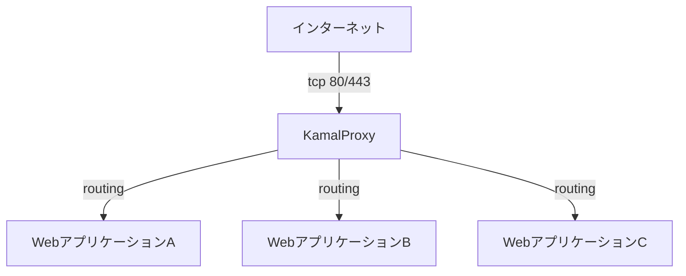

## 対象読者

- Kamal の仕組みを知りたい
- Kamal のメリットを知りたい
- Kamal の実際の運用方法を知りたい

※デプロイツールって何？Dockerって？という初学者は対象としていません。
※Kamalの基本的なインストール方法、導入方法については詳しく説明していません。

## はじめに
**この記事では、[Kamal v2](https://kamal-deploy.org/)を実際に案件で使ってみてわかったことをもとに、実践的なKamalの使い方を紹介します。**

Kamalは、RenderやECS+Fargateなどの商用サービスと違い特定のプラットフォームに依存せず、昔ながらのCapistranoなどと比べてデプロイ先の環境構築が容易かつゼロダウンタイムのデプロイが簡単にできる特徴があります。

私の経験でも「ゼロダウンタイムのデプロイ」をしたいがためにECS+Fargateの導入をご相談されるお客様もいますが、アプリケーションの規模に比べて構成が複雑になりすぎたり、クラウドインフラが非常に高価だったりと、課題があります。Kamalはそのようなケースでの利用にピッタリのツールです。

この記事を通じて、Kamalを実際に使ってみるにあたっての疑問点や、使っていくうえでの困りごとの解消に役立てば幸いです。

:::message
今後 Real World での運用で得た知見を記事に追記していく予定です。
:::

## Kamal とは？
**Kamalは任意のウェブアプリケーションをデプロイするためのツールです。** ゼロダウンタイムのデプロイ、ローリングスタート、アクセサリと呼ぶウェブアプリの運用に必要な付帯サービスの管理などをサポートします。もともとは Ruby on Rails のために作られましたが、コンテナ化できる任意のウェブアプリで利用できます。

**Kamalはコンテナ版のCapistranoと言えるもので、任意のサーバーに対してソースコードではなくコンテナをデプロイします。** コンテナをデプロイするので、Capistranoのようにサーバー側のRubyのセットアップなどの環境構築や構成管理の手間を軽減することができます。

### Kamalはデプロイを自由にする
**Kamalは特定のIaaS/PaaSにロックインされることを防ぎます**。SSHキーでログインできるLinuxサーバーであれば、自前のサーバーでもクラウドでも関係なくデプロイできます。

Kamalを使うことで、自前のサーバーや安価なVPSなどへのデプロイが簡単にできます。ツールの都合で特定の商用サービスにロックインされることなく、デプロイ先を柔軟に選択することができるようになります。

### LinuxやDockerの知識は必要
**Kamalは商用製品に頼らずオープンソースのツールを利用して本番環境にデプロイする際の複雑さを圧縮することを目的としているので、基本的なLinuxやDockerの知識が必要です。** が、これらに慣れていれば容易に理解することができます。

### 複雑な構成にはできない
**KamalはよくあるシンプルなWebアプリケーションのデプロイに最適化されていて、複雑なシステム構成や高度なオーケストレーションを必要とする場合には適用できないことがあります。** 例えば、多数のサービス間の依存関係や高度なスケーリング要件がある場合には、Kamalで構成することはできません。

## 利用の流れ
### install
https://kamal-deploy.org/docs/installation/

**Kamalのインストールは、rubygems または Dockerコンテナで行います。** リモートサーバー上でのインストールは不要です。root（[非rootユーザーでデプロイする方法は後述](#非rootユーザーでデプロイしたい)）で公開鍵認証によるSSHログインできるようにだけしてください。

:::details Rubyがインストールされている場合

```bash
gem install kamal
```

または bundle で導入

```bash
bundle add kamal --group development
```
:::

:::details Rubyがインストールされていない場合
Dockerコンテナとして実行すれば、Rubyのインストールは不要です。
https://kamal-deploy.org/docs/installation/dockerized/
:::

:::message
Dockerコンテナ版を使う場合や、Dev Container内のRubyでkamalを使う場合は、ssh-agentを通じて鍵を共有するため、ホストでssh-agentを起動しておく必要があります。
筆者の Ubuntu + WSL2 では以下のようにしています。

```bash:~/.bash_profile
if [ -z "$SSH_AUTH_SOCK" ]; then
   # Check for a currently running instance of the agent
   RUNNING_AGENT="`ps -ax | grep 'ssh-agent -s' | grep -v grep | wc -l | tr -d '[:space:]'`"
   if [ "$RUNNING_AGENT" = "0" ]; then
        # Launch a new instance of the agent
        ssh-agent -s &> $HOME/.ssh/ssh-agent
   fi
   eval `cat $HOME/.ssh/ssh-agent`
fi

ssh-add $HOME/.ssh/id_ed25519
```
:::

### kamal init
**設定ファイルなどを作成するには、 `kamal init` コマンドを実行します。**

```bash
yuichi@T16G3:~/myapp$ kamal init
Created configuration file in config/deploy.yml
Created .kamal/secrets file
Created sample hooks in .kamal/hooks
```

| 成果物 | 説明 |
| --- | --- |
| config/deploy.yml | 設定ファイル |
| .kamal/secrets | 設定ファイル中で使用する秘密情報を定義するファイル |
| .kamal/hooks | デプロイサイクル中のフックポイントで実行するスクリプト置き場 |

### kamal setup
**`kamal setup` コマンドを実行して、デプロイ先環境を構築します。**
コマンドを実行すると、Kamalは以下の操作を実行します。

1. SSHを使用してリモートサーバーに接続し、必要な場合はDockerをインストール
2. ローカルおよびリモートサーバーでコンテナレジストリにログイン
3. Dockerfileを使ってWebアプリのイメージをビルドして、コンテナレジストリにpush
4. リモートサーバー上でコンテナレジストリからWebアプリのイメージをpull
5. kamal-proxyコンテナの状態を確認し、必要ならpullして起動
6. 新しいwebアプリのコンテナを起動
7. 新しいwebアプリのコンテナがkamal-proxyからのヘルスチェックに成功するようになったら、kamal-proxyが新しいコンテナにルーティングするように変更
8. 古いコンテナがあれば停止
9. 使用されていないコンテナとイメージがあれば削除

:::details 設定例
```yml:config/deploy.yml
# サービス名。コンテナ名のプレフィクスとして使用される。
service: myapp
# Dockerイメージ名。コンテナレジストリにpushする名前。
image: takeyuweb/myapp
# デプロイ先のサーバーのIPアドレスまたはホスト名。
servers:
  - 192.168.0.10
# kamal-proxyの設定。
proxy:
  # Let's EncryptによるSSL/TLSサーバー証明書の自動取得を有効にする
  ssl: true
  # ホスト名でWebアプリのコンテナにルーティングする。ssl: trueの時は必須。
  host: myapp.host
  # Webアプリコンテナの待ち受けポート番号。Railsなら3000番。
  app_port: 3000
# Dockerコンテナレジストリの認証情報
registry:
  # 特にコンテナレジストリのサーバー名の指定がないときはDocker Hub
  # ユーザー名
  username: takeyuweb
  # パスワードは .kamal/secrets 定義の KAMAL_REGISTRY_PASSWORD の値を使用する
  password:
    - KAMAL_REGISTRY_PASSWORD
# docker build についての設定
builder:
  # CPUアーキテクチャ。amd64かarm64のいずれかまたはどちらか。
  # ローカルマシンと異なるアーキテクチャも、リモートビルドの設定を追加することで可能。
  arch: amd64
  context: .
  dockerfile: Dockerfile
# 環境変数
env:
  # Dockerコンテナ起動時のdockerコマンドに渡す環境変数
  clear:
    TZ: "Asia/Tokyo"
    DB_HOST: myapp-db
    DB_USER: root
  # リモートサーバー上のファイルに保存して、ファイルを経由してdockerコンテナに渡す環境変数
  # .kamal/secrets 定義のキーのリストを書く
  secret:
    - RAILS_MASTER_KEY
# リモートサーバーのSSH情報。
ssh:
  user: root
  port: 22
# Webアプリケーションなどメインのコンテナとは別に起動・管理したいコンテナ
accessories:
  db:
    image: mysql:8.0
    host: 192.168.0.10
    port: "127.0.0.1:3306:3306"
    env:
      clear:
        MYSQL_ROOT_HOST: '%'
      secret:
        - MYSQL_ROOT_PASSWORD
    directories:
      - data:/var/lib/mysql
```
:::

#### ネットワーク構成
**別途Nginxなどのリバースプロキシを設定する必要は、ありません。**
Kamal v2 ではWebアプリケーションコンテナの前段に**Kamal Proxy（kamal-proxyコンテナ）** が置かれます。HTTPリクエストは Kamal Proxy が受け取り、設定に応じてWebアプリコンテナに割り振ります。



#### アプリケーションの自動起動設定
**Kamal では、Webアプリケーションの自動実行のために特別な設定は必要ありません。** 一般的なLinuxサーバー上でWebアプリケーションを実行するとき、多くはサーバーを再起動しても自動的に開始するために `systemctl enable myapp` のような設定を必要とします。KamalではDockerコンテナを起動する際に `unless-stopped` 再起動ポリシーで起動するため、Dockerデーモン起動時に自動的に開始されます。

https://docs.docker.jp/config/container/start-containers-automatically.html

### kamal deploy
**`kamal deploy` コマンドを実行すると、現在のコードでイメージをビルド＆プッシュし、リモートサーバーで起動し、ヘルスチェックに合格すれば入れ替えを行います。**
`kamal setup` による環境構築後、アプリケーションの変更をデプロイするには `kamal deploy` コマンドを使用します。 

## Kamal Proxy
**Kamal Proxy は Kamal のために開発されたリバースプロキシです。** Kamal Proxyによって置き換えられる前は [Traefik：トラフィック](https://doc.traefik.io/traefik/) がリバースプロキシとして使用されていました。TraefikはKamalスタックの中で理解が難しい部分で、設定や運用が難しいことなどが問題となりました。Kamal Proxy はこれらの課題を解決するために作られた軽量なリバースプロキシです。

https://github.com/basecamp/kamal-proxy

### できること
- **ゼロダウンタイムデプロイ**
  - ヘルスチェックに合格してからトラフィックを新しいコンテナに向ける仕組み
- **デプロイメント間の asset bridging**
  - デプロイ中、新旧コンテナでCSSやJavaScriptファイルのファイル名が変わるとき、古いバージョンの名前へのリクエストが404を返してWebアプリが壊れるのを防ぐ
- **自動TLS**
  - Let's Encryptを利用したSSL/TLSサーバー証明書の取得と自動更新の仕組み（[golang.org/x/crypto/acme/autocert](https://pkg.go.dev/golang.org/x/crypto/acme/autocert)）
- **名前ベースのバーチャルホスト**
  - 複数のWebアプリを1つのサーバーで運用できる

### できないこと（v0.8.4 時点）
- **複数のサーバーをまたぐリクエストの割り振り（ロードバランシング）**
  - Kamal は複数のサーバーにデプロイできるが、複数サーバーのリクエストの割り振りは前段にロードバランサを設けるなど別途構成が必要
  - [Multiple targets per service (load balancing) #15](https://github.com/basecamp/kamal-proxy/issues/15)
- **名前ベース以外のバーチャルホストのルーティング**
  - ポートベース： `80` はapp1、`8080` はapp2 
  - パスベース： `/app1` は app1、 `/app2` は app2
    - [Add Support for Path-Based Routing in Kamal #48](https://github.com/basecamp/kamal-proxy/issues/48)

## Real World Kamal
ここからは、実際に Kamal を使っていくうえで困ったこと、調べたことなどをまとめていきます。

## デプロイ設定と操作
### 環境別に別々のデプロイ先を使いたい

ステージング環境本番環境など複数のデプロイ先がある場合、[Destination機能](https://kamal-deploy.org/docs/configuration/overview/#destinations)を利用します。

#### 環境別の秘密情報
`.kamal/secrets-<environment>` に記載します。
すべての環境で共通のものは `.kamal/secrets-common` です。

:::details 設定例
```plain:.kamal/secrets-staging
RAILS_MASTER_KEY=xxxxxxxxxxxxxxxxxxxxxxxxxxxxxxxx
```

```plain:.kamal/secrets-production
RAILS_MASTER_KEY=xxxxxxxxxxxxxxxxxxxxxxxxxxxxxxxx
```

```plain:.kamal/secrets-common
KAMAL_REGISTRY_PASSWORD=dckr_pat_xxxxxxxxxxxxxxxxxxxx
```
:::

#### 環境別のデプロイ設定
`config/deploy.<environment>.yml` を作成すると、 `config/deploy.yml` を上書きできます。

:::details 設定例
```yaml:config/deploy.yml
servers:
  web:
    cmd: bin/rails s
```

```yaml:config/deploy.staging.yml
servers:
  web:
    hosts:
      - 192.168.0.10
```

```yaml:config/deploy.production.yml
servers:
  web:
    hosts:
      - 192.168.1.10
```
:::

#### 環境別のデプロイコマンド
`kamal` の各種コマンド（ `deploy` `app` など ）のオプションとして `-d <destination>` を指定します。

:::details 使用例
```bash
bundle exec kamal deploy -d staging
bundle exec kamal app exec -i --reuse bash -d production
bundle exec kamal accessory boot all -d production
bundle exec kamal proxy details -d production
```
:::

:::message
デプロイフックの中で、デプロイの際に指定された Destination を取得するには、 `KAMAL_DESTINATION` 環境変数を使用します。

```bash:.kamal/hooks/pre-deploy
if [ -z "$KAMAL_DESTINATION" ]; then
  # Destination が指定されていいる
else
  # Destination が指定されていない
fi
```
:::

### files と volumes と directories
Kamalの `deploy.yml` にホストのファイルシステムをアプリコンテナにマウントする設定として `files` `directories` と `volumes` があります。それぞれ挙動が異なるので理解して使うことが必要です。

:::details files
**指定したローカルファイルをリモートサーバー上にアップロードしてマウントします。**

```yaml:config/deploy.yml
  db:
    image: mysql:8.0
    # 省略
    files:
      # - ローカルファイル名:コンテナ内でのマウントパス
      - config/mysql/production.cnf:/etc/mysql/my.cnf
      - db/production.sql:/docker-entrypoint-initdb.d/setup.sql
```

`files` に指定したローカルファイルは、 `kamal accessory boot` コマンドでアップロードされます。（[該当するコード](https://github.com/basecamp/kamal/blob/6f29d4e78bc29c3392f54f93ea0451ad1ff68b13/lib/kamal/cli/accessory.rb#L14)）

```plain:config/mysql/production.cnf
[mysqld]
character-set-server=utf8mb4
collation-server=utf8mb4_general_ci
max_allowed_packet=32MB
authentication_policy=mysql_native_password

[client]
default-character-set=utf8mb4
```

```sql:db/production.sql
CREATE DATABASE IF NOT EXISTS `myapp_production` DEFAULT CHARACTER SET utf8mb4 COLLATE utf8mb4_general_ci;
```

:::

::::details directories
**アクセサリコンテナ起動前にリモートサーバー上に[指定したディレクトリを作成](https://github.com/basecamp/kamal/blob/6f29d4e78bc29c3392f54f93ea0451ad1ff68b13/lib/kamal/cli/accessory.rb#L55)して、Dockerコンテナにマウントします。** 相対パスで記載した場合はアクセサリ用のデータディレクトリの下に作成します。絶対パスで指定した場合はそのパスに作成します。いずれもSSHで接続するデプロイユーザーの権限で作成できる必要があります。

https://github.com/basecamp/kamal/blob/6f29d4e78bc29c3392f54f93ea0451ad1ff68b13/lib/kamal/configuration/accessory.rb#L183-L185

```yaml:config/deploy.yml
accessories:
  db:
    image: mysql:8.0
    # 省略
    directories:
      - "/data/mysql:/var/lib/mysql"
      - "logs:/var/log/mysql"
```

```bash
$ bundle exec kamal accessory boot db
# 省略
# リモートサーバー上に以下のディレクトリが作成される。
#   /data/mysql
#   デプロイユーザーのホームディレクトリ/サービス名-アクセサリ名/logs
  INFO [4f1ab1b1] Running /usr/bin/env mkdir -p $PWD/myapp-db/logs on myapp.host
  INFO [4f1ab1b1] Finished in 0.021 seconds with exit status 0 (successful).
  INFO [0105230b] Running /usr/bin/env mkdir -p /data/mysql on myapp.host
  INFO [0105230b] Finished in 0.022 seconds with exit status 0 (successful).
```

:::message alert
**アクセサリのデータディレクトリは `kamal accessory remove` コマンドで削除されます。**
削除されては困るファイルを置く場合は絶対パスで指定するか、 `volumes` を使います。

```bash
$ bundle exec kamal accessory remove db
This will remove all containers, images and data directories for redis. Are you sure? [y, N] (N) y
# 省略
  INFO [a6aa6962] Running /usr/bin/env rm -rf myapp-db on myapp.host
  INFO [a6aa6962] Finished in 0.020 seconds with exit status 0 (successful).
```
:::
::::

:::details volumes
**Docker の `--volume` オプションそのもの。** リモートサーバー上の指定したパスをDockerコンテナにマウントします。 `directories` と異なり事前に作成しておく必要があります。

```yaml:config/deploy.yml
volumes:
  - "/data/storage:/app/storage"

accessories:
  db:
    image: mysql:8.0
    # 省略
    volumes:
      - "/data/mysql:/var/lib/mysql"
```

:::

:::message
アプリコンテナ（role） は `volumes` のみ、`files` `directories` はアクセサリ（accessories）でのみ指定できます。
:::

### 開発環境とデプロイ先のCPUアーキテクチャが違う
私はまだ遭遇していないので試せていません。

`builder` オプションに設定することでリモートビルドが可能なので、別途デプロイ先と同じCPUアーキテクチャの環境を用意して、そちらでDockerイメージをビルドすればよいようです。

https://kamal-deploy.org/docs/configuration/builder-examples/


## ロールとアクセサリ
### バックグランドジョブ実行用のプロセスを並走させたい

バックグランドジョブ実行用のroleを追加して、バックグランドジョブサーバーをフォアグラウンド実行します。

:::message
アプリケーション用のコンテナイメージを使用して、役割（ロール）別にコンテナを起動できます。
https://kamal-deploy.org/docs/configuration/roles/
:::

:::details 設定例
```yaml:config/deploy.yml
servers:
  web:
    cmd: bin/rails s
    hosts:
      - 192.168.0.10
  job:
    cmd: bin/jobs
    hosts:
      - 192.168.0.10
```
:::

### Cron を実行したい
cron実行用のroleを追加して、cronをフォアグラウンド実行 `cron -f` します。

https://kamal-deploy.org/docs/configuration/cron/

cronから実行するコマンドでDockerコンテナ起動時に渡した環境変数を使いたい場合、環境変数を書き出しておき、cronから実行するコマンドで読み込むことが必要です。（これはKamalに限定したテクニックではありませんが）

:::details 設定例
コマンド実行時のコンテナ内の環境変数を書き出しておき、 `BASH_ENV` で反映する。

```yaml:config/deploy.yml
servers:
  # 省略
  cron:
    cmd:
      bash -c "eval \$(printenv | awk -F= '{print \"export \" \"\\\"\"\$1\"\\\"\"\"=\"\"\\\"\"\$2\"\\\"\" }' >> /etc/environment); cat config/crontab | crontab - && cron -f"
    hosts:
      - 123.456.789.012
```

```plain:config/crontab
SHELL=/bin/bash
BASH_ENV=/etc/environment
30 0 * * * cd /app && bundle exec rails statistic:daily > /proc/1/fd/1 2>&1
```
:::


### MySQL使う
**『アクセサリ』を使うことでアプリケーションとは別に、任意のコンテナを管理することができます。** この機能を使ってMySQLコンテナを起動し、アプリコンテナから利用することができます。

https://kamal-deploy.org/docs/configuration/accessories/

:::details 設定例
```bash
$ bundle exec kamal accessory boot db
```

```yaml:config/deploy.yml
service: myapp
# 省略
env:
  clear:
    # 省略
    # ホスト名は サービス名-アクセサリ名
    DB_HOST: myapp-db
    DB_USER: root
  secret:
    # 省略
    - DB_PASSWORD

accessories:
  db:
    image: mysql:8.0
    host: myapp.host
    env:
      clear:
        MYSQL_ROOT_HOST: '%'
      secret:
        - MYSQL_ROOT_PASSWORD
    files:
      - config/mysql/my.cnf:/etc/mysql/my.cnf
      - db/setup.sql:/docker-entrypoint-initdb.d/setup.sql
    directories:
      - "/data/mysql:/var/lib/mysql"
```
:::

#### logrotate + mysqldump で日次バックアップ
ホストの logrotate でデータベースダンプを取りたいとき、[ホストのポートにマッピング](https://kamal-deploy.org/docs/configuration/accessories/)してホストの `mysqldump` から接続するか、コンテナ内の `mysqldump` を使い、Dockerネットワーク中のMySQLサーバに接続するかのどちらかになります。

Dockerネットワーク中のMySQLサーバに接続する場合、 `--net=kamal` オプションで起動中のMySQLコンテナと同じネットワークを使って起動し、 `mysqldump` の `-h` で起動中のコンテナを指定します。

:::details バックアップの取得
```bash
$ vi /etc/logrotate.d/mysqldump
$ /usr/sbin/logrotate -v -f /etc/logrotate.d/mysqldump
```

```plain:/etc/logrotate.d/mysqldump
/backup/mysqldump/myapp_production.sql.gz {
    daily
    rotate 14
    missingok
    notifempty
    nocompress
    postrotate
        docker run \
        --rm --net=kamal -v "/root/.my.cnf:/root/.my.cnf" \
        mysql:8.0 \
        mysqldump \
        -h myapp-db \
        --flush-logs \
        --quote-names \
        --hex-blob \
        --single-transaction \
        myapp_production | gzip > /backup/mysqldump/myapp_production.sql.gz
    endscript
}
```
:::

:::details バックアップのレストア
```bash
$ docker run \
-it --rm --net=kamal \
-v "/root/.my.cnf:/root/.my.cnf" \
-v "/tmp/myapp_production.sql:/tmp/myapp_production.sql" \
mysql:8.0 \
/bin/sh -c "mysql -h myapp-db myapp_production < /tmp/myapp_production.sql"
```
:::

#### MySQLコンテナで mbind: Operation not permitted がエラーログに記録される

コンテナが CAP_SYS_NICE ケーパビリティを利用できるようにする必要があります。

https://stackoverflow.com/questions/55559386/how-to-fix-mbind-operation-not-permitted-in-mysql-error-log

https://docs.docker.jp/config/container/resource_constraints.html

Kamalでこの設定を有効にするには、　`options` に `cap-add: sys_nice` を追加します。

:::details 設定例
```yaml:config/deploy.yml
accessories:
  db:
    image: mysql:8.0-debian
    # 省略
    options:
      # 省略
      cap-add: sys_nice
```
:::

#### mysqldのエラーログをDockerのログに出力したい
Docker logsでコンテナのログを表示するためには、Dockerコンテナの標準出力としてログを出力する必要があります。mysqldはログを標準出力に出せないので、工夫が必要です。

https://stackoverflow.com/questions/32938120/how-to-log-queries-to-stdout-on-mysql

:::details Kamalの設定
```yaml:config/deploy.yml
accessories:
  db:
    # 省略
    cmd: /usr/local/bin/mysqld.sh
    # 省略
    files:
      - config/mysql/mysqld.sh:/usr/local/bin/mysqld.sh
      - config/mysql/my.cnf:/etc/mysql/my.cnf
    # 省略
```
[filesについてはこちら](#files-%E3%81%A8-volumes-%E3%81%A8-directories)

```plain:config/mysql/my.cnf
[mysqld]
log_error = /var/log/mysqld.log
```

```bash:config/mysql/mysqld.sh
#!/usr/bin/env bash
set -euo pipefail

##
# This script exists to work-around the fact that
# mysql does not support logging to stdout
#
# This will tail the file logs configured in ./my.cnf
##

LOG_PATHS=(
  '/var/log/mysqld.log'
)
for LOG_PATH in "${LOG_PATHS[@]}"; do
  # https://serverfault.com/a/599209
  ( umask 0 && truncate -s0 "$LOG_PATH" )
  tail --pid $$ -n0 -F "$LOG_PATH" &
done

docker-entrypoint.sh mysqld
```
:::

### アクセサリコンテナを更新したい
アクセサリのコンテナのイメージを更新したり、オプションの変更を反映するには、コンテナを作り直します。
アクセサリのコンテナを作り直すには `kamal accessory reboot NAME` コマンドです。

:::details 実行例
```bash
# 更新前を確認
$ bundle exec kamal accessory details db -d production
  INFO [a6f33b36] Running docker ps --filter label=service=myapp-db on myapp.host
  INFO [a6f33b36] Finished in 0.909 seconds with exit status 0 (successful).
Accessory db Host: myapp.host
CONTAINER ID   IMAGE              COMMAND                  CREATED              STATUS              PORTS                                 NAMES
01e9150831d2   mysql:8.0-debian   "docker-entrypoint.s…"   31 hours ago     Up 27 hours   127.0.0.1:3306->3306/tcp, 33060/tcp   myapp-db

# コンテナの作り直し
$ bundle exec kamal accessory reboot db -d production

# 更新後の確認
$ bundle exec kamal accessory details db -d production
  INFO [54852e87] Running docker ps --filter label=service=myapp-db on myapp.host
  INFO [54852e87] Finished in 0.541 seconds with exit status 0 (successful).
Accessory db Host: myapp.host
CONTAINER ID   IMAGE              COMMAND                  CREATED          STATUS          PORTS                                 NAMES
0b17edc0d04c   mysql:8.0-debian   "docker-entrypoint.s…"   21 seconds ago   Up 20 seconds   127.0.0.1:3306->3306/tcp, 33060/tcp   myapp-db
```
:::

### アクセサリコンテナのbashを使いたい
アクセサリのコンテナに入るには `kamal accessory exec -i --reuse NAME bash` コマンドです。

:::details 実行例
```bash
$ bundle exec kamal accessory exec db -i --reuse bash -d production
Launching interactive command via SSH from existing container...
root@0b17edc0d04c:/# 
```
:::

## リバースプロキシの管理
### リクエストbodyサイズを制限したい

Kamal Proxy のバッファリング設定で可能です。

https://kamal-deploy.org/docs/configuration/proxy/#buffering

:::details 設定例
```yml:config/deploy.yml
proxy:
  # 省略
  buffering:
      max_request_body: 10_000_000
```
:::

kamal-proxy 0.8.4よりデフォルトでは無制限となりました。それ以前は1GB。
https://github.com/basecamp/kamal-proxy/commit/d9895fec592c47ab51ab580fec024e7c0af79e8c

### kamal proxy の待ち受けポートを変更したい

別途Nginxなどのリバースプロキシを置く場合、80/443以外のポートで待ち受けをしたいことがあります。その場合は、デプロイフックで Kamal Proxy の起動設定として指定できます。（アプリケーションごとの設定ではないので、 `config/deploy.yml` ではない。）

:::details デプロイフックで更新する場合
デプロイフックに書くと、Kamal Proxyの設定をコードで管理することができます。
デプロイフック中では、bundlerでインストールしている場合も `bundle exec` なしで動作します。
```bash:.kamal/hooks/pre-deploy
#!/bin/bash
set -ex

# Kamal Proxy コンテナの起動オプションを設定
kamal proxy boot_config set --https-port=10080 --http-port=10443
```
:::

:::details kamal コマンドで更新する場合
```bash
bundle exec kamal proxy boot_config set --https-port=10080 --http-port=10443
```
:::

https://kamal-deploy.org/docs/commands/proxy/

:::message alert
シングルサーバーで複数のアプリケーションをホストする場合、 Kamal Proxy はホストに1つであり、起動設定もホストで1つの為、それぞれのアプリケーションのデプロイフックで壊さないよう注意してください。
:::

## 運用
### アプリケーションのコンテナに接続してbashを使いたい
`kamal app exec` コマンドで、リモートサーバー上で起動中のコンテナまたは新しいコンテナを起動して接続することができます。

```bash
# 新しいコンテナを起動して接続する（docker run）
kamal app exec -i bash
# 起動中のコンテナに接続する（docker exec）
kamal app exec --reuse -i bash
```
:::details 実行例
production環境のwebロールで実行中のコンテナにインタラクティブモードで接続する
```bash
ruby ➜ /src (master) $ bundle exec kamal app exec --reuse -i bash -r web -d production
Launching interactive command with version latest-production via SSH from existing container on myapp.xxx...
root@f1eeec5f4d32:/app# echo $RAILS_ENV
production
root@f1eeec5f4d32:/app#
```
:::

### ロギング
KamalのログはDockerのログそのものなので、 `docker logs` コマンドや、Dockerのロギング・ドライバを使ってログ転送するなどして利用します。

#### コンテナのログを確認する

`kamal app logs` コマンドで、リモートサーバーの `docker logs` コマンドを実行してリアルタイムのログを表示できます。

:::details 利用例
```bash
bundle exec kamal app logs
# follow
bundle exec kamal app logs -f
# ロールを指定
bundle exec kamal app logs -f -r web
# 環境を指定
bundle exec kamal app logs -f -d production
```
:::

#### アプリケーションコンテナのログを rsyslog に転送する
`deploy.yml` にロギング設定を記載します。記載内容はDockerコンテナの起動コマンドに挿入されるので、Dockerのロギング・ドライバのドキュメントを参考に書きます。ホストのrsyslogに転送する場合、転送先のアドレスはローカルホスト宛でよいです。コンテナ内からではなく、dockerデーモンから見て、のIPアドレスになるため。

:::details 設定例
```yaml:config/deploy.yml
logging:
  driver: syslog
  options:
    syslog-address: udp://127.0.0.1:514
    syslog-facility: daemon
    tag: "web"
    syslog-format: rfc5424
```

特定のロールのログ設定は、ロールの下に書く。

```yaml:config/deploy.yml
servers:
  # 省略
  job:
    cmd: bin/jobs
    logging:
      driver: syslog
      options:
        syslog-address: udp://127.0.0.1:514
        syslog-facility: daemon
        tag: "job"
        syslog-format: rfc5424
```
:::

https://kamal-deploy.org/docs/configuration/logging/

https://docs.docker.jp/config/container/logging/configure.html#supported-logging-drivers

#### Kamal Proxy コンテナのログを rsyslog に転送する
Kamal Proxy起動設定 `--docker-options` で、Kamal Proxyコマンドを起動する `docker` コマンドに渡すオプションを設定できるので、これを使用してDockerのロギングドライバ設定を渡します。

:::details デプロイフックで更新する場合
デプロイフックに書くと、Kamal Proxyの設定をコードで管理することができます。
デプロイフック中では、bundlerでインストールしている場合も `bundle exec` なしで動作します。
```bash:.kamal/hooks/pre-deploy
#!/bin/bash
set -ex

# Kamal Proxy コンテナの起動オプションを設定
# - ホストの rsyslog にログを出力
# - ログのフォーマットを RFC5424 にする
kamal proxy boot_config set \
  --docker_options \
    log-driver=syslog \
    log-opt=syslog-address=udp://127.0.0.1:514 \
    log-opt=syslog-facility=daemon \
    log-opt=tag=proxy \
    log-opt=syslog-format=rfc5424 \
  --log-max-size=""
```
:::

:::details kamal コマンドで更新する場合
```bash
bundle exec kamal proxy boot_config set \
  --docker_options \
    log-driver=syslog \
    log-opt=syslog-address=udp://127.0.0.1:514 \
    log-opt=syslog-facility=daemon \
    log-opt=tag=proxy \
    log-opt=syslog-format=rfc5424 \
  --log-max-size=""
bundle exec kamal proxy reboot
```
:::

:::message alert
--log-max-size="" は必要？
現在のバージョン（ Kamal Proxy 0.84 ）では、 `--log-max-size=""` を指定しない場合 `--log-opt max-size=10m` がデフォルトでDockerコンテナの起動オプションとして渡されます。しかしログドライバによってはこのオプションは指定できず起動に失敗するため、必要です。

```bash
  INFO [8f81e3d6] Running docker run --name kamal-proxy --network kamal --detach --restart unless-stopped --volume kamal-proxy-config:/home/kamal-proxy/.config/kamal-proxy $(cat .kamal/proxy/options || echo "--publish 80:80 --publish 443:443 --log-opt max-size=10m") basecamp/kamal-proxy:v0.8.4 on myapp.host
Releasing the deploy lock...
  ERROR (SSHKit::Command::Failed): Exception while executing on host myapp.host: docker exit status: 125
docker stdout: Nothing written
docker stderr: docker: Error response from daemon: unknown log opt 'max-size' for syslog log driver.
See 'docker run --help'.
```
:::

:::details Kamal Proxy の起動設定の保存先
リモートサーバー上の `~/.kamal/proxy/options` に保存され、 `kamal-proxy` コンテナ起動時の `docker` コマンドのオプションとして使用されます。

```bash
deploy@myapp:~$ cat ~/.kamal/proxy/options
--publish 80:80 --publish 443:443 --log-driver=syslog --log-opt=syslog-address=udp://127.0.0.1:514 --log-opt=syslog-facility=daemon --log-opt=tag=proxy --log-opt=syslog-format=rfc5424 
```
:::

ロギング・ドライバについてはDockerのドキュメントを参照してください。
https://docs.docker.jp/config/container/logging/configure.html#supported-logging-drivers

### 特定のバージョンに戻したい

`kamal app boot --version=アプリバージョン文字列` で、指定したアプリバージョンのイメージで起動しなおすことができます。

:::details 利用例
実行中のアプリバージョンの確認
```bash
$ bundle exec kamal app version -d production
App Host: myapp.host
b1680c634f06ea84670e3db6fa2669a792480d7e
```

デプロイ（新しいバージョン）
```bash
$ bundle exec kamal deploy -d production
$ bundle exec kamal app version -d production
App Host: myapp.host
95bd526cb24478d392b139d51031108e9c849986
```

アプリバージョンを指定して戻す
```bash
$ bundle exec kamal app boot --version=b1680c634f06ea84670e3db6fa2669a792480d7e -d production
$ bundle exec kamal app version -d production
App Host: myapp.host
b1680c634f06ea84670e3db6fa2669a792480d7e
```
:::

:::message
アプリバージョンを指定しない `kamal app boot` では、実行中のアプリバージョン**ではなく**、 最新のバージョン（latest）になります。

```bash
$ bundle exec kamal app boot -d production
$ bundle exec kamal app version -d production
App Host: myapp.host
latest-production
```

latestがどのアプリバージョンかは `kamal app images` コマンドで確認できます。アプリバージョンはdockerイメージのタグに該当します。
```bash
$ bundle exec kamal app images -d production
  INFO [25b28fc6] Running docker image ls takeyuweb/myapp on myapp.host
  INFO [25b28fc6] Finished in 1.073 seconds with exit status 0 (successful).
App Host: myapp.host
REPOSITORY          TAG                                        IMAGE ID       CREATED      SIZE
takeyuweb/myapp   b1680c634f06ea84670e3db6fa2669a792480d7e   979a3a93be54   4 days ago   1.37GB
takeyuweb/myapp   latest-production                          979a3a93be54   4 days ago   1.37GB
takeyuweb/myapp   95bd526cb24478d392b139d51031108e9c849986   aa25b5847fe7   9 days ago   1.37GB
```

:::


### Kamal Proxy のアップデート
`kamal` コマンドで使用する Kamal Proxy のバージョンは Kamal のバージョンごとに固定されています。

https://github.com/basecamp/kamal/blob/6f29d4e78bc29c3392f54f93ea0451ad1ff68b13/lib/kamal/configuration.rb#L265

対応する Kamal Proxy のバージョンが変わる Kamal のアップデートがあったら、 `kamal proxy reboot` コマンドを実行すると、最新の Kamal Proxy を pull してコンテナを作り直すことができます。

:::details 実行例
```bash
$ bundle exec kamal proxy details -d production
  INFO [f6932bb7] Running docker ps --filter name=^kamal-proxy$ on myapp.host
  INFO [f6932bb7] Finished in 1.141 seconds with exit status 0 (successful).
Proxy Host: myapp.host
CONTAINER ID   IMAGE                         COMMAND             CREATED       STATUS       PORTS                                                                      NAMES
e6d2797bae5e   basecamp/kamal-proxy:v0.8.4   "kamal-proxy run"   2 weeks ago   Up 2 weeks   0.0.0.0:80->80/tcp, :::80->80/tcp, 0.0.0.0:443->443/tcp, :::443->443/tcp   kamal-proxy
$ bundle exec kamal proxy reboot -d production
This will cause a brief outage on each host. Are you sure? [y, N] (N) y
```
:::


## セキュリティ
### 非rootユーザーでデプロイしたい

- deploy.yml に使用するユーザー名を記入する
- デプロイに使用するユーザーで docker daemonを操作できるように設定しておく
  - サブグループに docker を追加する（[Manage Docker as a non-root user](https://docs.docker.com/engine/install/linux-postinstall/#manage-docker-as-a-non-root-user)）

:::details 設定例

```yml:config/deploy.yml
ssh:
  user: deploy
  # 鍵を指定する場合
  # ssh-agentを使用する場合は不要
  # keys:
  #   - ~/.ssh/deploy.id_ed2551
```

リモートサーバーに自身でDockerをインストールして、デプロイ用ユーザーで操作できるようにしておきます。

https://docs.docker.com/engine/install/ubuntu/

```bash
# Add Docker's official GPG key:
sudo apt-get update
sudo apt-get install ca-certificates curl
sudo install -m 0755 -d /etc/apt/keyrings
sudo curl -fsSL https://download.docker.com/linux/ubuntu/gpg -o /etc/apt/keyrings/docker.asc
sudo chmod a+r /etc/apt/keyrings/docker.asc

# Add the repository to Apt sources:
echo \
  "deb [arch=$(dpkg --print-architecture) signed-by=/etc/apt/keyrings/docker.asc] https://download.docker.com/linux/ubuntu \
  $(. /etc/os-release && echo "$VERSION_CODENAME") stable" | \
  sudo tee /etc/apt/sources.list.d/docker.list > /dev/null
sudo apt-get update

sudo apt-get install docker-ce docker-ce-cli containerd.io docker-buildx-plugin docker-compose-plugin

sudo adduser deploy
sudo usermod -aG docker deploy
```
:::

### ユーザ名前空間によるコンテナ分離を有効にする
セキュリティ上の理由で、DockerデーモンでLinuxユーザ名前空間によるコンテナ分離設定（userns-remap）を有効にしたいケースについて。

https://docs.docker.jp/engine/security/userns-remap.html
https://makiuchi-d.github.io/2024/06/08/klabtechbook11-docker-userns-remap.ja.html

 `kamal setup` コマンドではコンテナ分離を考慮したインストールにならないので、自分でDockerをインストールする必要があります。また、[デプロイに使用するユーザーを `root` 以外にする](#%E9%9D%9Eroot%E3%83%A6%E3%83%BC%E3%82%B6%E3%83%BC%E3%81%A7%E3%83%87%E3%83%97%E3%83%AD%E3%82%A4%E3%81%97%E3%81%9F%E3%81%84)必要があります。

また、 Kamal Proxy はホストの名前空間が必要なので、kamal-proxyコンテナの起動コマンドのオプションに `--userns=host` を追加する必要があります。

まとめると以下の対応が必要です。

1. Dockerをインストール
2. userns-remap を設定する
3. `kamal proxy boot_config` コマンドで起動設定に `--userns=host` オプションを追加する。

:::details デプロイフックで更新する場合
```bash:.kamal/hooks/pre-deploy
#!/bin/bash
set -ex

# Kamal Proxy コンテナの起動オプションを設定
kamal proxy boot_config set \
  --docker_options \
    userns=host
```
:::

:::details kamal コマンドで更新する場合
```bash
# 設定（ログドライバなど他に設定がある場合はそれも同時に書く）
bundle exec kamal proxy boot_config set \
  --docker_options \
    userns=host
# 設定内容の確認
bundle exec kamal proxy boot_config get
# 再起動して反映
bundle exec kamal proxy reboot
```
:::


## トラブルシューティング
### docker stderr: Error: host settings conflict with another service

role や destination の名前を変更して `kamal deploy` すると、`docker stderr: Error: host settings conflict with another service` というエラーでデプロイに失敗しました。

https://github.com/basecamp/kamal/issues/1147

上記Issueを参考に、いったん Kamal Proxy からサービスを削除して再度デプロイを試すことで解消しました。

:::details 実行例
リモートホスト上で実行
```bash
$ docker exec kamal-proxy kamal-proxy ls
Service      Host       Target             State    TLS  
myapp-web  myapp.host  bc7fd00e0df7:3000  running  yes 
$ docker exec kamal-proxy kamal-proxy remove myapp-web
```

ローカルホスト上で実行
```bash
$ bundle exec kamal deploy
```
:::

### acme/autocert: missing certificate
Dockerのユーザー名前空間を有効にすると、 Kamal Proxy で `acme/autocert: missing certificate` というエラーが発生し、起動できなくなりました。

結論から書くと、 [Kamal Proxy コンテナの起動オプションに `--userns=host` を追加する](#%E3%83%A6%E3%83%BC%E3%82%B6%E5%90%8D%E5%89%8D%E7%A9%BA%E9%96%93%E3%81%AB%E3%82%88%E3%82%8B%E3%82%B3%E3%83%B3%E3%83%86%E3%83%8A%E5%88%86%E9%9B%A2%E3%82%92%E6%9C%89%E5%8A%B9%E3%81%AB%E3%81%99%E3%82%8B)ことで起動できました。

:::details 原因について
[Kamal Proxy の Dockerfile](https://github.com/basecamp/kamal-proxy/blob/26a4da3ddb134d4a831e9a9829db70fd1a29a4eb/Dockerfile#L11-L14)を確認すると、 `kamal-proxy` ユーザーで実行されていました。

`kamal-proxy` コンテナは `/home/kamal-proxy/.config/kamal-proxy` にマウントします。
`userns-remap` の場合、マウントしたディレクトリの書き込み権限がコンテナ内の `kamal-proxy` ユーザーになく、正しく動作しないことがわかりました。

```bash
$ docker inspect <kamal-proxyのコンテナID>
```

マウント設定を抜粋

```json
        "Mounts": [
            {
                "Type": "volume",
                "Name": "kamal-proxy-config",
                "Source": "/var/lib/docker/1001.1001/volumes/kamal-proxy-config/_data",
                "Destination": "/home/kamal-proxy/.config/kamal-proxy",
                "Driver": "local",
                "Mode": "z",
                "RW": true,
                "Propagation": ""
            }
        ],
```
:::

## おわりに

この記事では、Kamal v2 を実際に案件で使ってみてわかった内容をもとに、実践的なKamalの使い方を紹介しました。Kamalは特定の商用プラットフォームに依存せず、昔ながらのCapistranoなどと比べてデプロイ先の環境構築が容易かつゼロダウンタイムのデプロイが簡単にできる特徴があります。

KamalとKamal Proxyはまだ新しいツールなので、まだ足りない機能や、バグに遭遇することもしばしばあります。しかし、Kamalの進化と共にこれらの課題は改善されていくことが期待できます。

この記事を通じて、Kamalを実際に使ってみるにあたっての疑問点や、使っていくうえでの困りごとの解消に役立てば幸いです。今後もKamalを使用して得た知見を基に、さらに実践的で効果的な運用方法を追求し、共有していきたいと考えています。
