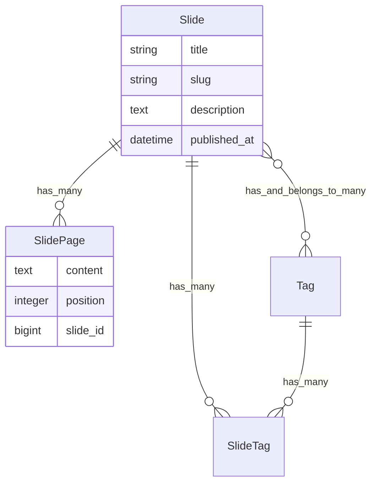

# Railsアプリケーションのスライド機能実装

竹内雄一
2025年8月16日

---

# アジェンダ

1. 背景と目的
2. 技術スタック
3. 実装のポイント
4. デモンストレーション
5. まとめ

---

# 背景と目的

## 現状の課題
- 発表資料が外部サービスに分散
- 自己ブランディング資産として活用できていない

## 解決策
- ポートフォリオサイトで公開: 一元管理による効率化
- 効率的な記事執筆: AIによる執筆支援とバージョン管理

---

# 技術スタック

## バックエンド
- Ruby on Rails 8.0

## フロントエンド
- Turbo
- Stimulus
- TailwindCSS

---

# 実装のポイント

## 1. データモデル設計
```ruby
class Slide < ApplicationRecord
  has_many :slide_pages
  has_many :tags
end

class SlidePage < ApplicationRecord
  belongs_to :slide
end
```

---

# 実装のポイント（続き）

## 2. Markdownパーサー
- Marp記法をサポート
- `---`でページを分割
- インポート時にHTMLへ変換

## 3. キーボード操作
- 矢印キーでページ遷移
- Stimulusコントローラーで実装

---

# AIを活用した開発プロセス

## Claude Codeによる実装支援
- 要件定義から実装まで一貫したサポート
- テスト駆動開発（TDD）の実践
- コードレビューと改善提案

---

# AI支援による要件定義

## 対話的な要件整理
- 機能の目的と背景の明確化
- 技術的な実現方法の提案
- 段階的な実装計画の策定

## 今回の例
1. 「Markdownでスライドを作成し公開」という要望
2. Marp記法、slug管理、Draft機能などの詳細化
3. MVPから段階的な機能追加の計画

---

# AI支援による設計書作成

## 設計ドキュメントの自動生成
- データベース設計（ER図相当の説明）
- APIインターフェース定義
- 実装アーキテクチャの提案

---

# 実際の設計内容


---

# AI支援開発のポイント（1/3）

## 1. 段階的な実装
- ToDoリストによるタスク管理
- 小さな単位での実装とテスト
  - テストを失敗→成功させる
- 継続的な進捗確認
  - 大枠のアーキテクチャについて確認
  - 詳細は任せる

---

# AI支援開発のポイント（2/3）

## 2. テスト駆動開発
```ruby
# Request Spec の例
describe "GET /slides/:id" do
  it "displays the slide title" do
    get slide_path(slide)
    expect(response.body).to include(slide.title)
  end
end
```

- 仕様を明確化
- リグレッション防止
- リファクタリングの安全性確保

---

# AI支援開発のポイント（3/3）

## 3. MCPツールの開発
```json
{
  "method": "tools/call",
  "params": {
    "name": "create_slide_tool",
    "arguments": {
      "content": "Markdownコンテンツ"
    }
  }
}
```

- 外部からのコンテンツ管理
- 自動化による効率化

---

# 開発実績

## 実装内容
- スライド機能の完全実装
- MCPサーバー統合
- 包括的なテストスイート

---

# デモンストレーション

実際の動作をご覧ください

- スライド表示
- ページ遷移
- レスポンシブデザイン
- タグ機能

---

# まとめ

## 実装のメリット
- 発表資料の一元管理
- SEO効果の期待
- 自己ブランディングの強化

## 今後の展開
- PDFエクスポート
- スピーカーノート
- テーマカスタマイズ

---

# ご清聴ありがとうございました

質問はありますか？

GitHub: @takeyuweb
X: @takeyuweb