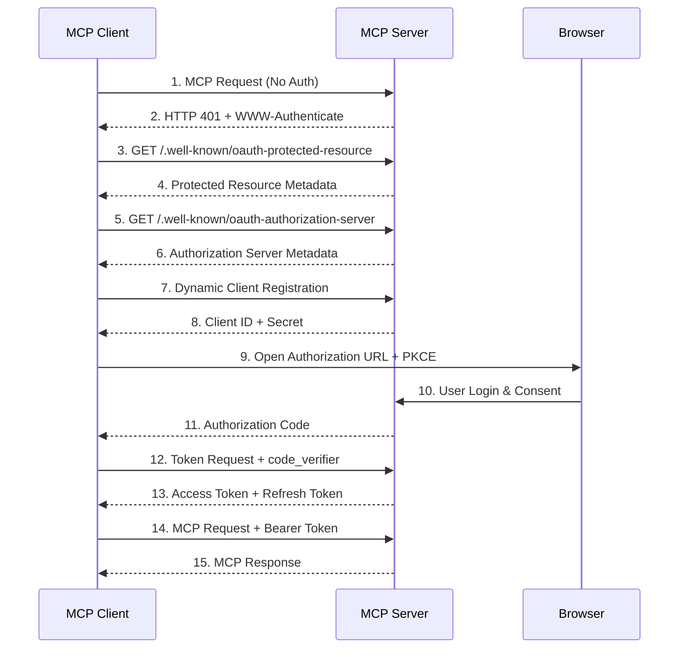

# MCP OAuth認証仕様 調査レポート

## 1. MCP仕様におけるOAuth認証フロー

### 1.1 概要

MCPは2025年3月にOAuth 2.1を使用した認可仕様を正式に採用した。

- **基準仕様**: OAuth 2.1 IETF DRAFT
- **MCP仕様**: https://modelcontextprotocol.io/specification/2025-03-26/basic/authorization

### 1.2 必須エンドポイント

| エンドポイント | パス | 説明 |
|--------------|------|------|
| Authorization Endpoint | `/authorize` | 認可リクエスト |
| Token Endpoint | `/token` | トークン交換・更新 |
| Registration Endpoint | `/register` | 動的クライアント登録 |

### 1.3 Discoveryエンドポイント

| エンドポイント | パス | RFC |
|--------------|------|-----|
| Authorization Server Metadata | `/.well-known/oauth-authorization-server` | RFC 8414 |
| Protected Resource Metadata | `/.well-known/oauth-protected-resource` | RFC 9728 |

### 1.4 対応OAuthフロー

#### Authorization Code Grant + PKCE（必須）

- すべてのMCPクライアントでPKCEが必須
- SHA-256を使用したcode_challenge生成
- クライアントが人間のユーザーを代理する場合に使用

#### Client Credentials Grant

- クライアントがアプリケーション（人間でない）の場合に使用

### 1.5 認証フロー図



---

## 2. 現在のMCP gemの状況

### 2.1 バージョン情報

| 項目 | 値 |
|------|-----|
| インストール済み | 0.1.0 |
| 最新バージョン | 0.4.0 |
| リポジトリ | github.com/modelcontextprotocol/ruby-sdk |

### 2.2 OAuth機能サポート

**結論: mcp gem (0.1.0) にOAuth認証機能は含まれていない**

認証は`server_context`パラメータを通じてアプリケーションレベルで実装する設計となっている。

```ruby
server = MCP::Server.new(
  name: "my_server",
  server_context: { user_id: current_user.id }
)
```

---

## 3. 実装オプションの比較

### Option A: Doorkeeper gem を使用

Rails標準のOAuth 2.0 Providerライブラリ。

**メリット**:
- 成熟したライブラリ、豊富なドキュメント
- Rails統合が優れている
- PKCE、Dynamic Client Registrationをサポート
- Google OAuthとの連携実績あり

**デメリット**:
- データベーステーブルが必要（oauth_applications, oauth_access_tokens等）
- 設定項目が多い

**必要な実装**:
- Doorkeeper初期設定
- OAuthエンドポイント（/oauth/authorize, /oauth/token）
- Discovery エンドポイント（/.well-known/*）
- Google OAuth連携（omniauth-google-oauth2）

### Option B: カスタム実装

MCP仕様に必要な最小限のOAuthエンドポイントを自前で実装。

**メリット**:
- 軽量、シンプル
- 不要な機能がない
- データベース不要（セッションベースで実装可能）

**デメリット**:
- OAuth仕様の理解が必要
- セキュリティ面での検証が必要
- 保守コストが高い

### Option C: 外部認証サービス（Auth0, Okta等）

外部のIdentity Providerを使用。

**メリット**:
- セキュリティが担保されている
- 管理画面が提供される
- 多要素認証などの高度な機能

**デメリット**:
- 外部サービス依存
- コストが発生する可能性
- 設定の複雑さ

---

## 4. 推奨実装方針

### 4.1 推奨: Option A（Doorkeeper）

以下の理由からDoorkeeperを使用した実装を推奨する：

1. **Rails標準的なアプローチ**: Railsコミュニティで広く使われている
2. **MCP仕様準拠が容易**: 必要なエンドポイントをすべてカバー
3. **Admin画面とMCP両方に対応**: 同じOAuth基盤を共有可能
4. **Google OAuth統合**: omniauth-google-oauth2との連携が確立されている

### 4.2 実装アーキテクチャ

```mermaid
flowchart TB
    subgraph External
        Google[Google OAuth]
        Claude[Claude AI App]
    end

    subgraph Rails App
        subgraph OAuth Provider
            AuthEndpoint[/oauth/authorize]
            TokenEndpoint[/oauth/token]
            Discovery[/.well-known/*]
        end

        subgraph Controllers
            AdminCtrl[Admin::BaseController]
            McpCtrl[Api::McpController]
        end

        Session[(Rails Session)]
        Doorkeeper[(Doorkeeper)]
    end

    Google --> AuthEndpoint
    Claude --> Discovery
    Claude --> AuthEndpoint
    Claude --> TokenEndpoint
    Claude --> McpCtrl

    AuthEndpoint --> Doorkeeper
    TokenEndpoint --> Doorkeeper
    AdminCtrl --> Session
```

### 4.3 トークン管理の推奨設定

| 項目 | 推奨値 | 理由 |
|------|--------|------|
| アクセストークン有効期限 | 1時間 | セキュリティとユーザビリティのバランス |
| リフレッシュトークン | 有効 | トークン更新でユーザー再認証を回避 |
| リフレッシュトークン有効期限 | 30日 | 長期間のセッション維持 |

### 4.4 localhost開発環境

**結論: 可能（比較的容易）**

Google OAuth 2.0はlocalhostをリダイレクトURIとしてサポートしている。

**設定手順**:
1. Google Cloud Consoleで「承認済みのリダイレクトURI」に追加:
   - `http://localhost:3000/oauth/callback`
   - `http://localhost:3000/users/auth/google_oauth2/callback`
2. 開発環境用のClient ID/Secretを使用

**注意点**:
- 本番環境と開発環境で別のOAuthクライアントを使用することを推奨
- localhostはHTTP許可（本番はHTTPS必須）

---

## 5. 必要なGem

```ruby
# Gemfile

# OAuth 2.0 Provider
gem "doorkeeper"

# Google OAuth
gem "omniauth"
gem "omniauth-google-oauth2"
gem "omniauth-rails_csrf_protection"
```

---

## 6. 参考資料

### MCP仕様
- https://modelcontextprotocol.io/specification/2025-03-26/basic/authorization

### Doorkeeper
- https://github.com/doorkeeper-gem/doorkeeper
- https://doorkeeper.gitbook.io/guides/

### Claude MCP設定
- https://support.claude.com/en/articles/11503834-building-custom-connectors-via-remote-mcp-servers
- https://code.claude.com/docs/en/mcp
