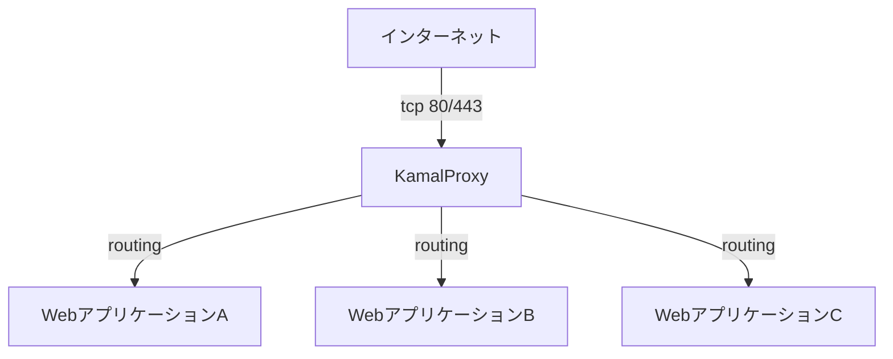
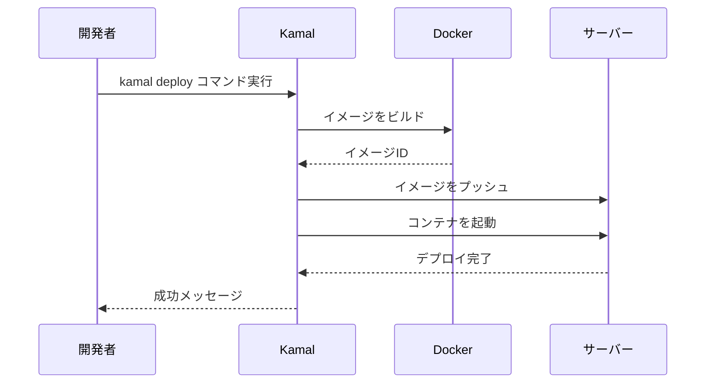

# カスタムMarkdown仕様書

## 概要

このドキュメントでは、Spotlight Railsアプリケーションで使用されているカスタムMarkdown機能の仕様を説明します。このカスタムMarkdown実装は、標準的なMarkdown構文に加えて、折りたたみ可能な詳細ブロック、メッセージブロック、アラートメッセージブロック、Mermaid図表などの拡張機能を提供します。

## 基本実装

カスタムMarkdownの実装は、以下のコンポーネントで構成されています：

1. **CustomHtmlRenderer**: Redcarpetライブラリを拡張したカスタムレンダラー
2. **Stimulus.js コントローラ**: 折りたたみ機能などのインタラクティブな要素を制御
3. **Tailwind CSS**: スタイリングとレスポンシブデザイン

## カスタムブロック構文

### リンクカード (Link Card)

URLのみの行を自動的にリンクカードとして表示します。リンクカードはURLのメタデータ（タイトル、説明、サムネイル画像など）を取得して表示します。

#### 構文

```markdown
https://example.com
```

#### レンダリング結果

- URLのメタデータを取得して表示するカード
- タイトル、説明、ドメイン情報、サムネイル画像（利用可能な場合）を表示
- カードをクリックするとリンク先に移動
- メタデータはAjaxで非同期に取得されるため、ページの初期表示は高速

### 詳細ブロック (Details)

折りたたみ可能なコンテンツブロックを作成します。タイトルをクリックすると内容の表示/非表示を切り替えられます。

#### 構文

```markdown
:::details タイトル
詳細内容をここに記述
:::
```

または、ネストされたブロック用に4つのコロンを使用：

```markdown
::::details タイトル
詳細内容をここに記述

:::message
ネストされたメッセージ
:::

さらにテキスト
::::
```

#### レンダリング結果

- 灰色のボーダーを持つ折りたたみ可能なブロック
- タイトルバーにはタイトルテキストと折りたたみ状態を示す矢印アイコン
- 初期状態では内容は非表示
- クリックすると内容が表示され、矢印の向きが変わる

### メッセージブロック (Message)

強調されたメッセージを表示するためのブロック。

#### 構文

```markdown
:::message
メッセージ内容をここに記述
:::
```

または、ネストされたブロック用に4つのコロンを使用：

```markdown
::::message
メッセージ内容をここに記述
::::
```

#### レンダリング結果

- 琥珀色の左ボーダーと背景を持つブロック
- テキストは琥珀色で表示
- コードブロックなど他のMarkdown要素も内部に含めることが可能

### アラートメッセージブロック (Alert Message)

警告や重要な情報を強調するためのブロック。

#### 構文

```markdown
:::message alert
アラートメッセージ内容をここに記述
:::
```

または、ネストされたブロック用に4つのコロンを使用：

```markdown
::::message alert
アラートメッセージ内容をここに記述
::::
```

#### レンダリング結果

- 赤色の左ボーダーと背景を持つブロック
- テキストは赤色で表示
- 警告や重要な情報を目立たせるのに適している

### Mermaid図表 (Mermaid Diagram)

Mermaid構文で記述された図表を動的に描画するためのブロック。フローチャート、シーケンス図、クラス図などを簡単に作成できます。

#### 構文

````markdown

````

#### レンダリング結果

- Mermaid.jsライブラリを使用して図表を動的に描画
- フロントエンドでJavaScriptによって処理されるため、ページ読み込み後に図表が表示される
- ダークモードに対応し、テーマ切り替え時に図表も自動的に再描画される
- エラーが発生した場合は、エラーメッセージを表示

### 拡張画像表示 (Enhanced Image Display)

Markdown内の画像表示機能を拡張し、幅指定やキャプションなどの追加機能をサポートします。

#### 構文バリエーション

##### 1. 基本的な画像表示
図表やスクリーンショットなどを表示します。
```markdown

```

##### 2. 画像の横幅を指定
画像の横幅をピクセル単位で指定できます。
```markdown

```

##### 3. Altテキストを指定
画像の代替テキストを指定できます。
```markdown

```

##### 4. キャプションを追加
画像のすぐ下の行に`*`で挟んだテキストを配置すると、キャプションとして表示されます。
```markdown

*キャプション*
```

##### 5. 画像にリンクを設定
画像をクリックすると指定したURLに遷移するようにリンクを設定できます。
```markdown
[](リンクURL)
```

#### パス解決ルール

画像ファイルパスは以下のルールで解決されます：

1. **絶対パス**（`/`で始まるパス）：
   - そのまま使用されます
   - 例：`/images/photo.jpg` → `/images/photo.jpg`
   - これらの画像は`public`ディレクトリに配置する必要があります

2. **相対パス**（`/`で始まらないパス）：
   - Rails Asset Pipelineを通して解決されます
   - 例：`logo.png` → `/assets/images/logo-a1b2c3d4e5f6.png`（digest付き）
   - これらの画像は`app/assets/images`ディレクトリに配置する必要があります
   - Asset Pipelineによるdigest付きのファイル名に自動的に対応します

3. **URL**（`http://`または`https://`で始まるパス）：
   - そのまま使用されます
   - 例：`https://example.com/image.jpg` → `https://example.com/image.jpg`

#### レンダリング結果

- 画像は`<figure>`要素で囲まれ、適切なスタイリングが適用されます
- 画像は最大幅100%でレスポンシブに表示されます
- 角丸のスタイリングが適用されます
- キャプションが指定された場合は、画像の下に表示されます
- 幅が指定された場合は、指定された幅で表示されます
- リンクが設定された場合は、画像をクリックするとリンク先に移動します

## ネスト機能

カスタムブロックは互いにネストすることができます。ネストする場合は、外側のブロックに4つのコロン（`::::`)、内側のブロックに3つのコロン（`:::`)を使用します。

### 例

```markdown
::::details 外側のタイトル
外側のテキスト

:::details 内側のタイトル
内側のテキスト
:::

:::message
内側のメッセージ
:::

外側の続き
::::
```

## コードブロックとの併用

カスタムブロック内では、標準的なMarkdownのコードブロックを使用できます。

### 例

```markdown
:::message
コードブロック:

```ruby
def hello
  puts "Hello, world!"
end
```
:::
```

## 技術的実装

### レンダリングプロセス

1. **前処理 (preprocess)**:
   - カスタムブロック構文を検出し、一時的なプレースホルダーに置き換え
   - プレースホルダーとブロック情報をマッピングして保存
   - 画像キャプションを検出し、適切なHTMLに変換

2. **Markdown変換**:
   - 標準的なMarkdown構文をHTMLに変換

3. **後処理 (postprocess)**:
   - プレースホルダーを対応するHTMLに置き換え
   - ネストされたブロックを再帰的に処理
   - 画像タグを検出し、`<figure>`要素で囲む
   - 画像パスをAssetPathResolverサービスで解決

### サービスオブジェクト

画像パスの解決には、サービスオブジェクトパターンを採用しています：

- **ApplicationService**: サービスオブジェクトの基底クラス
  - クラスメソッド`.call`を提供し、インスタンス生成と実行を簡略化
  - 各サービスクラスは`call`メソッドを実装する必要がある

- **AssetPathResolver**: 画像パスを解決するサービス
  - 画像パスを受け取り、Asset Pipeline対応のパスに変換
  - 幅指定を検出して削除し、別途取得できるようにする
  - 相対パスをAsset Pipeline経由で解決し、digest付きのパスを返す

### インタラクティブ機能

詳細ブロックの折りたたみ機能は、Stimulus.jsコントローラによって制御されます：

- **details_controller.js**: 詳細ブロックの表示/非表示を切り替え
- 初期状態では内容は非表示（`hidden`クラスを適用）
- クリック時に内容の表示/非表示を切り替え、矢印アイコンの回転も制御

リンクカード機能も、Stimulus.jsコントローラによって制御されます：

- **link_card_controller.js**: URLからメタデータを取得してリンクカードを表示
- ページ読み込み後にAjaxリクエストでメタデータを取得
- 取得したメタデータを使用してリンクカードを動的に生成
- エラー時は元のリンクをそのまま表示

Mermaid図表機能も、Stimulus.jsコントローラによって制御されます：

- **mermaid_controller.js**: Mermaid構文を図表として描画
- ページ読み込み後にMermaid.jsライブラリを使用して図表を動的に生成
- ダークモード切り替え時に図表を再描画
- エラー時はエラーメッセージを表示

### APIエンドポイント

リンクカード機能は、以下のAPIエンドポイントを使用してURLのメタデータを取得します：

- **GET /api/link_cards/metadata**: URLからメタデータを取得するエンドポイント
  - パラメータ: `url` - メタデータを取得するURL
  - レスポンス: JSONオブジェクト（タイトル、説明、ドメイン、ファビコン、画像URL）
  - エラー処理: URLが無効な場合やメタデータ取得に失敗した場合はエラーレスポンスを返す
  - キャッシュ機能: 同じURLに対するリクエストは24時間キャッシュされる

### キャッシュ機能

リンクカードのメタデータは、パフォーマンス向上のためにデータベースにキャッシュされます：

- **キャッシュ期間**: デフォルトで24時間（`config/initializers/link_metadata_cache.rb`で設定可能）
- **キャッシュの仕組み**:
  - 初回リクエスト時にメタデータを取得してデータベースに保存
  - 2回目以降のリクエストでは、キャッシュが有効な場合はデータベースから取得
  - キャッシュが期限切れの場合は、新しいメタデータを取得してキャッシュを更新
- **メリット**:
  - 外部サイトへのリクエスト回数を削減
  - レスポンス時間の短縮
  - サーバーリソースの節約

### スタイリング

Tailwind CSSを使用して、各ブロックタイプに適したスタイルを適用：

- **リンクカード**: 白い背景、角丸、影効果、ホバー時の強調表示
- **詳細ブロック**: 灰色のボーダー、角丸、タイトルバーのホバー効果
- **メッセージブロック**: 琥珀色の左ボーダーと背景、琥珀色のテキスト
- **アラートブロック**: 赤色の左ボーダーと背景、赤色のテキスト

## 目次機能との連携

カスタムMarkdownは、アプリケーションの目次機能と連携しています：

- 記事内の見出し（h2, h3, h4, h5, h6）を自動的に検出
- 見出しレベルに応じた階層構造を持つ目次を生成
- 目次項目をクリックすると、対応する見出しへスムーズにスクロール
- 記事をスクロールすると、現在表示されている見出しに対応する目次項目がハイライト

## 使用例

### リンクカードの例

```markdown
# インストール方法

Kamalのウェブサイトを参照してください：

https://kamal-deploy.org

詳細なドキュメントはGitHubリポジトリにあります：

https://github.com/basecamp/kamal
```

### 詳細ブロックの例

```markdown
:::details Rubyがインストールされている場合

```bash
gem install kamal
```

または bundle で導入

```bash
bundle add kamal --group development
```
:::
```

### メッセージブロックの例

```markdown
:::message
今後 Real World での運用で得た知見を記事に追記していく予定です。
:::
```

### アラートメッセージブロックの例

```markdown
:::message alert
アクセサリのデータディレクトリは `kamal accessory remove` コマンドで削除されます。
削除されては困るファイルを置く場合は絶対パスで指定するか、 `volumes` を使います。
:::
```

### Mermaid図表の例

````markdown
# Kamalのアーキテクチャ

Kamalは以下のようなアーキテクチャで構成されています：


また、デプロイプロセスは以下のようなシーケンスで行われます：


````

### 拡張画像表示の例

#### 基本的な画像表示

```markdown
# スクリーンショット


上記は管理画面のスクリーンショットです。
```

#### 画像の横幅を指定

```markdown
# ロゴ


ロゴの幅を200pxに指定しています。
```

#### Altテキストを指定

```markdown
# アクセシビリティ対応


スクリーンリーダーでAltテキストが読み上げられます。
```

#### キャプションを追加

```markdown
# 図表


*図1: システムアーキテクチャ概要*

上記の図表はシステム全体の構成を示しています。
```

#### 画像にリンクを設定

```markdown
# 詳細を見る

[](https://example.com/details)

画像をクリックすると詳細ページに移動します。
```

## 制限事項と注意点

1. カスタムブロックのネストは、外側に4つのコロン、内側に3つのコロンを使用する必要があります
2. 複数レベルのネストも可能ですが、深すぎるネストは可読性を損なう可能性があります
3. カスタムブロック内では標準的なMarkdown構文が使用できますが、一部の複雑な構造では予期しない結果になる場合があります
4. リンクカード機能は、URLのみの行に対してのみ適用されます。段落内のURLには適用されません
5. リンクカードのメタデータ取得はAjaxで非同期に行われるため、ページ読み込み直後は通常のリンクとして表示され、その後カードに変わります
6. 外部サイトのURLによっては、メタデータの取得に失敗する場合があります（CORSポリシーやサイトの構造による）
7. Mermaid図表は、JavaScriptが有効なブラウザでのみ描画されます
8. 複雑なMermaid図表は、描画に時間がかかる場合があります
9. Mermaid構文にエラーがある場合、図表の代わりにエラーメッセージが表示されます
10. 画像ファイルの配置場所（`public`ディレクトリまたは`app/assets/images`ディレクトリ）を理解する必要があります
11. キャプションは画像の直後の行に配置する必要があり、複数行のキャプションはサポートされていません
12. 画像の幅指定は現在のバージョンでは横幅のみサポートされており、単位はpxのみです
13. Asset Pipeline経由の画像は、開発環境と本番環境でパスが異なる場合があります（digest有無など）

## 今後の拡張可能性

1. **追加のブロックタイプ**:
   - コードブロックの拡張（コピーボタン、行番号表示など）
   - 引用ブロックのカスタマイズ
   - タブ切り替え機能

2. **スタイルのカスタマイズ**:
   - ブロックのテーマ設定
   - ダークモード対応の強化
   - リンクカードのレイアウトバリエーション（横型/縦型など）

3. **インタラクティブ機能の拡張**:
   - アニメーション効果の追加
   - 詳細ブロックの状態保存
   - リンクカードのプレビュー機能（ホバー時に拡大表示など）

4. **リンクカード機能の強化**:
   - メタデータのキャッシュ機能（同じURLに対する重複リクエストの削減）
   - カスタムリンクカードの作成（URLに加えてタイトルや説明を指定可能に）
   - 埋め込みコンテンツのサポート（YouTube、Twitter、Githubなど特定サイト向けの特殊表示）

5. **Mermaid図表機能の強化**:
   - 図表のエクスポート機能（SVG、PNG形式での保存）
   - インタラクティブな図表機能（ノードのクリックイベントなど）
   - 図表のズーム機能
   - カスタムテーマの追加

6. **画像表示機能の強化**:
   - 高さの指定サポート
   - 複数行キャプションのサポート
   - 画像ギャラリー機能（複数画像のグリッド表示）
   - 画像のズーム/拡大表示機能
   - 画像の自動最適化（WebP変換など）
