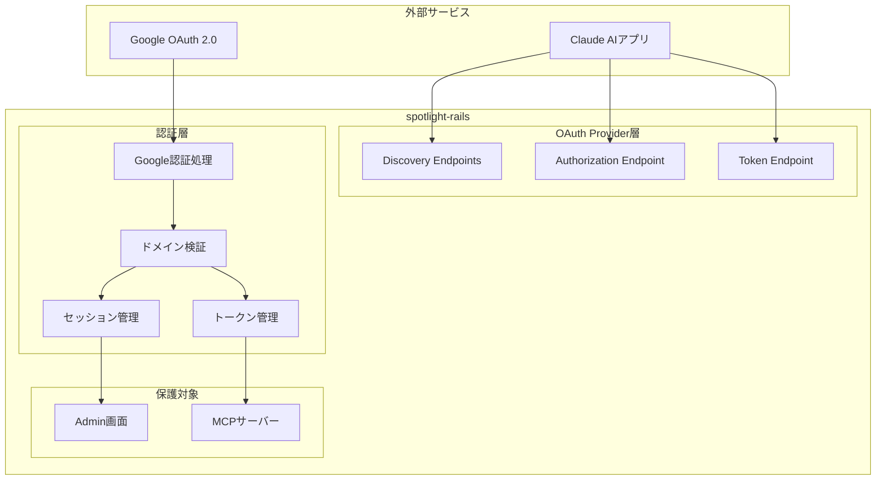
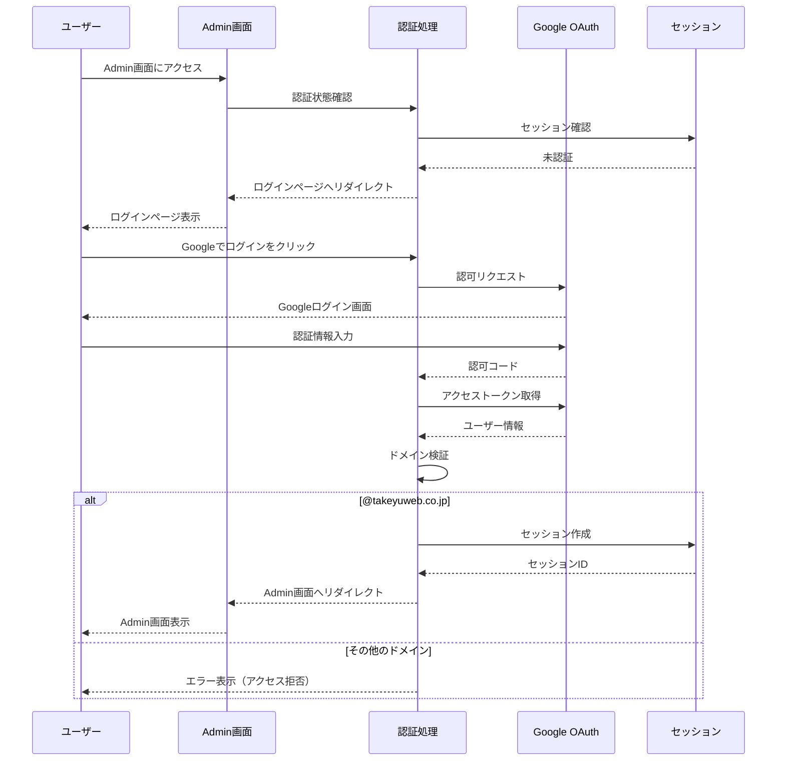
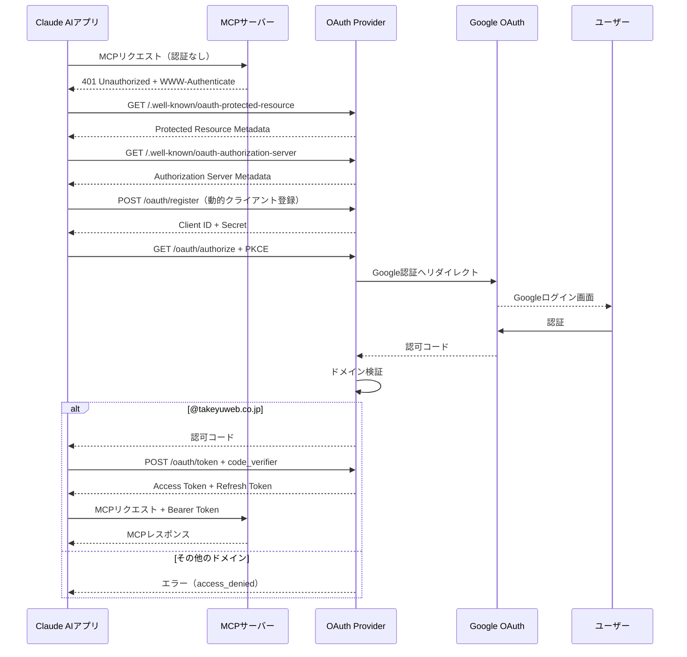

# OAuth認証対応 機能設計書

## 1. 機能概要

本設計書は、spotlight-railsアプリケーションにOAuth認証機能を追加するための設計を定義する。

### 対象機能

1. Admin画面のGoogleログイン
2. MCPサーバーのOAuth認証（MCP仕様準拠）

### 関連ドキュメント

- 要件定義書: [oauth_authentication_requirements.md](oauth_authentication_requirements.md)
- 調査レポート: [mcp_oauth_research_report.md](mcp_oauth_research_report.md)

---

## 2. システムアーキテクチャ

### 2.1 全体構成

### 2.2 認証方式の使い分け

| 対象 | 認証方式 | セッション管理 |
|------|----------|---------------|
| Admin画面 | Google OAuth → Railsセッション | Cookieベース |
| MCPサーバー | OAuth 2.0 Provider | アクセストークン |

---

## 3. Admin画面のGoogleログイン

### 3.1 認証フロー

### 3.2 処理仕様

#### 3.2.1 ログインページ表示

- Admin画面にアクセスした未認証ユーザーをログインページにリダイレクト
- 「Googleでログイン」ボタンを表示

#### 3.2.2 Google OAuth認証

- Google OAuth 2.0の認可コードフローを使用
- 取得するスコープ: email, profile

#### 3.2.3 ドメイン検証

- 取得したメールアドレスのドメイン部分を抽出
- `@takeyuweb.co.jp` と一致するか検証
- 一致しない場合はエラーメッセージを表示し、ログインを拒否

#### 3.2.4 セッション管理

- 認証成功時にRailsセッションにユーザー情報を保存
- 保存する情報: メールアドレス、表示名
- ログアウト時にセッションを破棄

### 3.3 画面仕様

#### ログインページ

| 要素 | 説明 |
|------|------|
| タイトル | Admin ログイン |
| ログインボタン | 「Googleでログイン」 |
| エラー表示エリア | ドメイン拒否時のメッセージ表示 |

#### Admin画面ヘッダー

| 要素 | 説明 |
|------|------|
| ユーザー情報 | ログイン中のメールアドレスまたは表示名 |
| ログアウトリンク | クリックでログアウト処理を実行 |

---

## 4. MCPサーバーのOAuth認証

### 4.1 MCP仕様準拠

MCP Authorization仕様（2025-03-26版）に準拠したOAuth 2.0 Providerを実装する。

### 4.2 必要なエンドポイント

#### 4.2.1 Discoveryエンドポイント

| エンドポイント | パス | 説明 |
|--------------|------|------|
| Protected Resource Metadata | `/.well-known/oauth-protected-resource` | MCPサーバーのメタデータ |
| Authorization Server Metadata | `/.well-known/oauth-authorization-server` | 認可サーバーのメタデータ |

#### 4.2.2 OAuthエンドポイント

| エンドポイント | パス | 説明 |
|--------------|------|------|
| Authorization | `/oauth/authorize` | 認可リクエスト |
| Token | `/oauth/token` | トークン発行・更新 |
| Registration | `/oauth/register` | 動的クライアント登録 |

### 4.3 認証フロー

### 4.4 処理仕様

#### 4.4.1 Protected Resource Metadata

MCPサーバーの情報を提供する。

| フィールド | 説明 |
|-----------|------|
| resource | MCPサーバーのURL |
| authorization_servers | 認可サーバーのURL一覧 |
| scopes_supported | サポートするスコープ |

#### 4.4.2 Authorization Server Metadata

OAuth認可サーバーの情報を提供する。

| フィールド | 説明 |
|-----------|------|
| issuer | 認可サーバーの識別子 |
| authorization_endpoint | 認可エンドポイントURL |
| token_endpoint | トークンエンドポイントURL |
| registration_endpoint | クライアント登録エンドポイントURL |
| response_types_supported | サポートするレスポンスタイプ |
| grant_types_supported | サポートするグラントタイプ |
| code_challenge_methods_supported | PKCEのサポート方式 |

#### 4.4.3 動的クライアント登録

Claude AIアプリからのクライアント登録リクエストを処理する。

| 入力 | 説明 |
|------|------|
| redirect_uris | コールバックURL一覧 |
| client_name | クライアント名 |
| grant_types | 使用するグラントタイプ |

| 出力 | 説明 |
|------|------|
| client_id | 発行されたクライアントID |
| client_secret | 発行されたクライアントシークレット |

#### 4.4.4 認可リクエスト

PKCE対応の認可コードフローを処理する。

| パラメータ | 説明 |
|-----------|------|
| response_type | `code`（必須） |
| client_id | クライアントID（必須） |
| redirect_uri | コールバックURL（必須） |
| scope | 要求するスコープ |
| state | CSRF対策用のランダム文字列 |
| code_challenge | PKCE code_challenge（必須） |
| code_challenge_method | `S256`（必須） |

#### 4.4.5 トークン発行

認可コードをアクセストークンに交換する。

| 入力パラメータ | 説明 |
|---------------|------|
| grant_type | `authorization_code` |
| code | 認可コード |
| redirect_uri | コールバックURL |
| client_id | クライアントID |
| code_verifier | PKCE code_verifier |

| 出力 | 説明 |
|------|------|
| access_token | アクセストークン |
| token_type | `Bearer` |
| expires_in | 有効期限（秒） |
| refresh_token | リフレッシュトークン |

#### 4.4.6 トークン更新

リフレッシュトークンを使用してアクセストークンを更新する。

| 入力パラメータ | 説明 |
|---------------|------|
| grant_type | `refresh_token` |
| refresh_token | リフレッシュトークン |
| client_id | クライアントID |

#### 4.4.7 MCPリクエスト認証

MCPサーバーへのリクエスト時にBearerトークンを検証する。

- Authorizationヘッダーからトークンを取得
- トークンの有効性を検証（有効期限、発行元）
- 有効な場合はMCPツールへのアクセスを許可
- 無効な場合は401 Unauthorizedを返却

### 4.5 トークン管理

| 項目 | 仕様 |
|------|------|
| アクセストークン有効期限 | 1時間 |
| リフレッシュトークン有効期限 | 30日 |
| トークン形式 | ランダム文字列（暗号学的に安全） |

---

## 5. データ設計

### 5.1 データベーステーブル

#### oauth_applications（OAuthクライアント）

| 項目名 | キー | データ型 | 必須 | 説明 |
|--------|------|----------|------|------|
| id | PK | BIGINT | ○ | 主キー |
| name | | VARCHAR | ○ | クライアント名 |
| uid | UK | VARCHAR | ○ | クライアントID |
| secret | | VARCHAR | ○ | クライアントシークレット |
| redirect_uri | | TEXT | ○ | コールバックURL |
| scopes | | VARCHAR | | 許可スコープ |
| confidential | | BOOLEAN | ○ | 機密クライアントフラグ |
| created_at | | DATETIME | ○ | 作成日時 |
| updated_at | | DATETIME | ○ | 更新日時 |

#### oauth_access_tokens（アクセストークン）

| 項目名 | キー | データ型 | 必須 | 説明 |
|--------|------|----------|------|------|
| id | PK | BIGINT | ○ | 主キー |
| application_id | FK | BIGINT | | OAuthアプリケーションID |
| token | UK | VARCHAR | ○ | アクセストークン |
| refresh_token | UK | VARCHAR | | リフレッシュトークン |
| expires_in | | INTEGER | | 有効期限（秒） |
| revoked_at | | DATETIME | | 失効日時 |
| scopes | | VARCHAR | | 許可スコープ |
| previous_refresh_token | | VARCHAR | | 前回のリフレッシュトークン |
| created_at | | DATETIME | ○ | 作成日時 |

#### oauth_access_grants（認可コード）

| 項目名 | キー | データ型 | 必須 | 説明 |
|--------|------|----------|------|------|
| id | PK | BIGINT | ○ | 主キー |
| application_id | FK | BIGINT | ○ | OAuthアプリケーションID |
| token | UK | VARCHAR | ○ | 認可コード |
| expires_in | | INTEGER | ○ | 有効期限（秒） |
| redirect_uri | | TEXT | ○ | コールバックURL |
| scopes | | VARCHAR | | 許可スコープ |
| code_challenge | | VARCHAR | | PKCE code_challenge |
| code_challenge_method | | VARCHAR | | PKCE method |
| revoked_at | | DATETIME | | 失効日時 |
| created_at | | DATETIME | ○ | 作成日時 |

### 5.2 セッションデータ（Admin画面）

Railsの標準セッション機能（Cookieストア）を使用。

| キー | 説明 |
|------|------|
| admin_email | ログイン中のメールアドレス |
| admin_name | ログイン中の表示名 |

---

## 6. セキュリティ設計

### 6.1 ドメイン制限

- すべての認証フローで `@takeyuweb.co.jp` ドメインを検証
- ドメイン不一致の場合は即座に認証を拒否
- エラーログに拒否されたメールアドレスを記録（セキュリティ監査用）

### 6.2 PKCE（Proof Key for Code Exchange）

- MCPサーバーのOAuth認証でPKCEを必須とする
- code_challenge_method は `S256` のみサポート
- code_verifier は最低43文字、最大128文字

### 6.3 HTTPS

- 本番環境ではすべてのOAuthエンドポイントでHTTPSを必須
- 開発環境ではlocalhostに対してHTTPを許可

### 6.4 トークンセキュリティ

- トークンは暗号学的に安全な乱数で生成
- トークンはハッシュ化してデータベースに保存
- 失効したトークンは再利用不可

### 6.5 CSRF対策

- 認可リクエストでstateパラメータを必須
- コールバック時にstateを検証

---

## 7. エラー処理

### 7.1 Admin画面

| エラー | 表示メッセージ | 処理 |
|--------|---------------|------|
| ドメイン拒否 | 「このアカウントではログインできません。@takeyuweb.co.jp のアカウントをお使いください。」 | ログインページにリダイレクト |
| Google認証エラー | 「Googleとの認証に失敗しました。再度お試しください。」 | ログインページにリダイレクト |
| セッション切れ | （メッセージなし） | ログインページにリダイレクト |

### 7.2 MCPサーバーOAuth

| エラー | OAuthエラーコード | HTTPステータス |
|--------|------------------|----------------|
| ドメイン拒否 | access_denied | 403 |
| 無効なクライアント | invalid_client | 401 |
| 無効な認可コード | invalid_grant | 400 |
| 無効なトークン | invalid_token | 401 |
| トークン期限切れ | invalid_token | 401 |
| PKCE検証失敗 | invalid_grant | 400 |

---

## 8. 開発環境対応

### 8.1 localhost対応

Google OAuth 2.0はlocalhostをリダイレクトURIとしてサポートしている。

#### Google Cloud Console設定

- 開発用OAuthクライアントを作成
- 承認済みリダイレクトURIに以下を追加:
  - `http://localhost:3000/auth/google_oauth2/callback`
  - `http://localhost:3000/oauth/callback`

#### Rails設定

- 開発環境用のClient ID/Secretを環境変数またはcredentialsで管理
- 本番環境と開発環境で別のOAuthクライアントを使用

---

## 9. 必要なライブラリ

| ライブラリ | 用途 |
|-----------|------|
| doorkeeper | OAuth 2.0 Provider機能 |
| omniauth | OAuthクライアント抽象化 |
| omniauth-google-oauth2 | Google OAuth連携 |
| omniauth-rails_csrf_protection | OmniAuth CSRF対策 |

### mcp gemアップデート

- 現行: 0.1.0
- 更新先: 0.4.0
- 目的: 最新のMCP仕様サポート

---

## 10. テスト観点

### 10.1 Admin画面

- [ ] 未認証状態でAdmin画面にアクセスするとログインページにリダイレクトされる
- [ ] Googleログインボタンをクリックすると Google認証画面に遷移する
- [ ] @takeyuweb.co.jp のアカウントでログインできる
- [ ] @takeyuweb.co.jp 以外のアカウントはログインが拒否される
- [ ] ログイン後、Admin画面の各機能にアクセスできる
- [ ] ログアウトするとセッションが破棄される
- [ ] ログアウト後、Admin画面にアクセスするとログインページにリダイレクトされる

### 10.2 MCPサーバーOAuth

- [ ] /.well-known/oauth-protected-resource が正しいメタデータを返す
- [ ] /.well-known/oauth-authorization-server が正しいメタデータを返す
- [ ] 動的クライアント登録が動作する
- [ ] PKCE付き認可コードフローが動作する
- [ ] @takeyuweb.co.jp のアカウントで認証できる
- [ ] @takeyuweb.co.jp 以外のアカウントは認証が拒否される
- [ ] アクセストークンでMCPリクエストが成功する
- [ ] 無効なトークンでMCPリクエストが拒否される
- [ ] リフレッシュトークンでアクセストークンを更新できる
- [ ] アクセストークンが1時間で期限切れになる
- [ ] リフレッシュトークンが30日で期限切れになる
