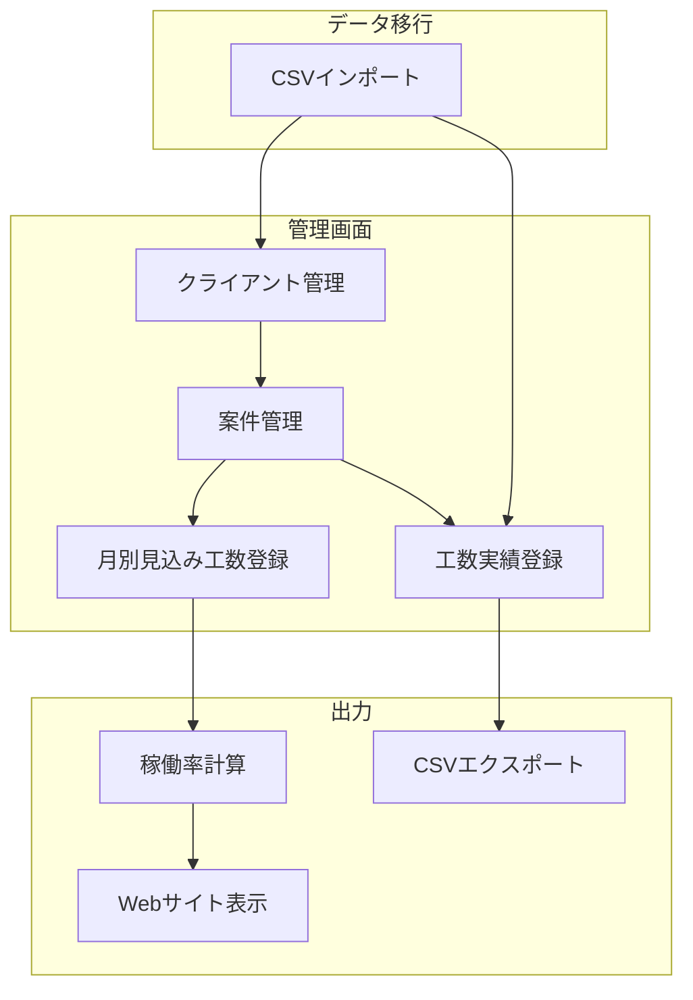

# 工数管理機能 機能設計書

**機能名**: 工数管理機能
**バージョン**: 1.0
**作成日**: 2025年12月12日

## 1. 機能概要

### 1.1 目的

- クライアント向けの作業報告・請求根拠として工数実績を管理する
- Webサイト上の「今後3カ月の稼働予定」に稼働率を動的に表示する
- 既存の外部工数管理サービスから移行し、自前で工数を管理する

### 1.2 主要機能

1. **クライアントマスタ管理**: 発注元クライアントの基本情報を管理
2. **案件マスタ管理**: プロジェクト情報と月別見込み工数を管理
3. **工数実績管理**: 日々の作業実績をカレンダー形式で記録・表示
4. **稼働率表示**: 見込み工数から稼働率を計算しWebサイトに表示
5. **CSVインポート**: 外部サービスからのデータ移行
6. **CSVエクスポート**: 作業報告用のデータ出力

### 1.3 処理フロー概要



## 2. データ要件

### 2.1 マスタデータ

#### 2.1.1 クライアント

**テーブル名**: `clients`

| 項目名 | キー | データ型 | 必須 | 説明 |
|--------|------|----------|------|------|
| id | PK | bigint | ○ | 主キー |
| code | UK | string | ○ | クライアントコード（一意識別子） |
| name | | string | ○ | クライアント名 |
| created_at | | datetime | ○ | 作成日時 |
| updated_at | | datetime | ○ | 更新日時 |

**制約**:
- UNIQUE KEY(code)

**目的**:
- 案件の発注元を管理
- CSVインポート時の自動生成対象

#### 2.1.2 案件

**テーブル名**: `projects`

| 項目名 | キー | データ型 | 必須 | 説明 |
|--------|------|----------|------|------|
| id | PK | bigint | ○ | 主キー |
| code | UK | string | ○ | プロジェクトコード（一意識別子） |
| name | | string | ○ | プロジェクト名 |
| client_id | FK | bigint | | クライアントID |
| color | | string | ○ | 表示カラー（HEX形式） |
| start_date | | date | | 開始日 |
| end_date | | date | | 終了日 |
| status | | string | ○ | 運用ステータス |
| created_at | | datetime | ○ | 作成日時 |
| updated_at | | datetime | ○ | 更新日時 |

**制約**:
- UNIQUE KEY(code)
- FOREIGN KEY(client_id) REFERENCES clients(id)

**目的**:
- 工数実績の紐づけ先
- 月別見込み工数の紐づけ先

**運用ステータス**:
- `active`: 運用中
- `closed`: 終了

#### 2.1.3 月別見込み工数

**テーブル名**: `project_monthly_estimates`

| 項目名 | キー | データ型 | 必須 | 説明 |
|--------|------|----------|------|------|
| id | PK | bigint | ○ | 主キー |
| project_id | UK, FK | bigint | ○ | 案件ID |
| year_month | UK | date | ○ | 対象年月（月初日で保存） |
| estimated_hours | | decimal | ○ | 見込み工数（時間） |
| created_at | | datetime | ○ | 作成日時 |
| updated_at | | datetime | ○ | 更新日時 |

**制約**:
- UNIQUE KEY(project_id, year_month)
- FOREIGN KEY(project_id) REFERENCES projects(id)

**目的**:
- 稼働率計算の元データ
- 案件ごとの月間予定工数を管理

### 2.2 トランザクションデータ

#### 2.2.1 工数実績

**テーブル名**: `work_entries`

| 項目名 | キー | データ型 | 必須 | 説明 |
|--------|------|----------|------|------|
| id | PK | bigint | ○ | 主キー |
| project_id | FK | bigint | | 案件ID（NULLの場合は「その他」） |
| worked_on | | date | ○ | 作業日 |
| target_month | | date | ○ | 対象月（月初日で保存） |
| description | | text | | 業務内容 |
| minutes | | integer | ○ | 工数実績（分） |
| created_at | | datetime | ○ | 作成日時 |
| updated_at | | datetime | ○ | 更新日時 |

**制約**:
- FOREIGN KEY(project_id) REFERENCES projects(id)
- INDEX(worked_on)
- INDEX(target_month)

**目的**:
- 日々の作業実績を記録
- CSVエクスポートの元データ

**「その他」の扱い**:
- project_idがNULLの場合、案件に紐づかない作業として扱う

## 3. 計算ロジック

### 3.1 稼働率計算

#### 3.1.1 月間稼働率

```
月間稼働率(%) = (対象月の見込み工数合計 ÷ 基準稼働時間) × 100
```

計算手順：
1. 対象月の全案件の見込み工数を合計
2. 基準稼働時間（160時間）で除算
3. 100を乗算してパーセントに変換
4. 100%を超える場合は100%として扱う

#### 3.1.2 計算例

```
案件A: 80時間
案件B: 60時間
案件C: 40時間
合計: 180時間

稼働率 = min(180 ÷ 160 × 100, 100) = 100%
```

### 3.2 工数の単位変換

#### 3.2.1 分から時間への変換

```
時間 = 分 ÷ 60
```

- 工数実績は分単位で保存
- 表示時に時間単位に変換（必要に応じて）
- CSVエクスポートは分単位のまま出力

## 4. ビジネスルール

### 4.1 基準値

#### 4.1.1 基準稼働時間
- **値**: 160時間/月（固定）
- **目的**: 稼働率計算の分母
- **根拠**: 8時間 × 20営業日

#### 4.1.2 稼働率の上限
- **値**: 100%
- **目的**: 表示上の上限値
- **処理**: 計算結果が100%を超える場合は100%として表示

### 4.2 対象月の決定

#### 4.2.1 工数実績の対象月
- 工数登録時に対象月を明示的に指定
- 作業日と対象月が異なる月でも登録可能
  - 例：12月1日に11月分の工数を登録

### 4.3 稼働率表示の対象期間

#### 4.3.1 表示範囲
- 今月を含む3カ月分を表示
- 例：12月の場合 → 12月、1月、2月

## 5. 画面機能

### 5.1 画面構成

#### 5.1.1 管理画面一覧

| 画面名 | 概要 |
|--------|------|
| クライアント一覧 | クライアントの一覧表示、CRUD操作 |
| 案件一覧 | 案件の一覧表示、CRUD操作 |
| 案件詳細 | 案件情報の編集、月別見込み工数の管理 |
| 工数カレンダー | カレンダー形式での工数表示・登録 |
| CSVインポート | CSV取り込み画面 |
| CSVエクスポート | CSV出力画面 |

### 5.2 工数カレンダー

#### 5.2.1 表示形式
- **週表示**: 1週間分の工数を表示
- **月表示**: 1カ月分の工数を表示

#### 5.2.2 表示内容
- 日ごとの工数エントリ
- 案件ごとの色分け表示
- 日ごとの合計時間
- 週/月の合計時間

#### 5.2.3 操作
- 日付クリックで工数登録
- エントリクリックで編集・削除

### 5.3 稼働率表示（公開サイト）

#### 5.3.1 表示内容
- 対象年月（例：2025年1月）
- 稼働率（パーセント表示）
- プログレスバー（視覚的な稼働率表示）

#### 5.3.2 表示位置
- トップページの「お仕事の募集状況」セクション
- 既存のハードコーディングを置き換え

## 6. CSV入出力

### 6.1 CSVインポート

#### 6.1.1 案件マスタインポート

**処理フロー**:
1. CSVファイルをアップロード
2. ヘッダー行を解析してマッピングを確認
3. 各行を処理:
   - 「発注元」からクライアントを検索または作成
   - プロジェクトコードで既存案件を検索
   - 存在すれば更新、なければ新規作成
4. 処理結果（成功/失敗件数）を表示

**エラー処理**:
- 必須項目（プロジェクトコード、プロジェクト名）が空の場合はスキップ
- エラー行は一覧で表示

#### 6.1.2 工数実績インポート

**処理フロー**:
1. CSVファイルをアップロード
2. ヘッダー行を解析してマッピングを確認
3. 各行を処理:
   - プロジェクトコードで案件を検索
   - 案件が見つからない場合はproject_id=NULLで登録
   - 「その他」の場合もproject_id=NULL
4. 処理結果を表示

### 6.2 CSVエクスポート

#### 6.2.1 出力形式

```csv
対象月,工数登録日,プロジェクト,プロジェクトコード,業務内容,工数実績(分)
```

#### 6.2.2 処理フロー
1. 対象期間を指定（開始月〜終了月）
2. 案件フィルタを指定（任意）
3. 対象データを抽出
4. CSVファイルを生成してダウンロード

#### 6.2.3 出力ルール
- 対象月: `YYYY年MM月` 形式
- 工数登録日: `YYYY年MM月DD日` 形式
- 「その他」の場合: プロジェクト名=「その他」、プロジェクトコード=空欄
- 文字コード: UTF-8（BOM付き）

## 7. 認証・認可

### 7.1 管理画面のアクセス制御

#### 7.1.1 認証方式
- HTTP Basic認証

#### 7.1.2 認証情報
- ユーザー名: Rails Credentialsで管理
- パスワード: Rails Credentialsで管理

#### 7.1.3 対象範囲
- 工数管理の全管理画面

### 7.2 公開サイト

#### 7.2.1 稼働率表示
- 認証不要
- 誰でも閲覧可能

---

**関連資料**:
- [工数管理機能 要件定義書](./work_hour_management_requirements.md)
- [お仕事の募集状況表示機能 仕様書](./availability_status_feature.md)
