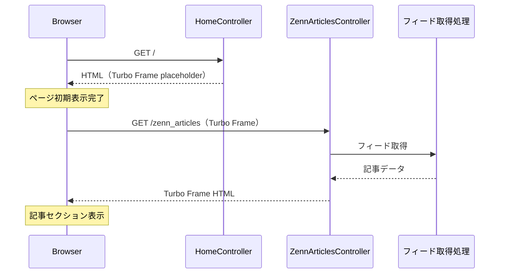

# Zenn RSSフィード取得機能設計書

**機能名**: Zenn RSSフィード取得機能
**バージョン**: 1.0
**作成日**: 2025年12月9日

## 1. 機能概要

### 1.1 目的

- トップページにZenn Publicationの最新記事を表示し、訪問者をZennの記事へ誘導する
- Article機能廃止後も、技術記事への導線を維持する
- 外部プラットフォーム（Zenn）のコンテンツを自サイトに統合表示する

### 1.2 主要機能

1. **RSSフィード取得**: Zenn PublicationのRSSフィードからの記事情報取得
2. **キャッシュ管理**: フィード取得結果のキャッシュによるパフォーマンス最適化
3. **非同期読み込み**: Turbo Frameによる記事セクションの遅延読み込み
4. **トップページ表示**: 取得した記事のタイトル・リンクをトップページに表示

### 1.3 処理フロー概要

#### 1.3.1 フィード取得処理

1. キャッシュの有無を確認
2. キャッシュが有効な場合、キャッシュからデータを返却
3. キャッシュが無効または存在しない場合、RSSフィードを取得
4. 取得したフィードをパースし、記事情報を抽出
5. 結果をキャッシュに保存
6. 記事情報を返却

#### 1.3.2 エラーハンドリング

1. フィード取得失敗時はキャッシュされた古いデータを使用（stale-while-revalidate）
2. キャッシュも存在しない場合は空の配列を返却
3. エラーをログに記録

#### 1.3.3 トップページ表示（Turbo Frame非同期読み込み）

1. トップページ初期表示時、記事セクションはローディング状態のTurbo Frameを表示
2. Turbo Frameが専用エンドポイントに非同期リクエスト
3. エンドポイントでフィード取得処理を実行
4. 取得した記事一覧から表示件数分を抽出
5. 記事カードをTurbo Frame内にレンダリング

## 2. データ要件

### 2.1 RSSフィードデータ（入力）

**データソース**: https://zenn.dev/p/takeyuwebinc/feed

**フォーマット**: RSS 2.0

**取得項目**:

| 項目名 | XML要素 | 説明 | 使用有無 |
|--------|---------|------|----------|
| タイトル | title | 記事のタイトル | ○ |
| リンク | link | 記事のURL | ○ |
| 概要 | description | 記事の抜粋テキスト | △（将来検討） |
| 公開日 | pubDate | 公開日時（RFC形式） | ○ |
| 著者 | dc:creator | 著者名 | △（将来検討） |
| 画像 | enclosure | OGP画像URL | △（将来検討） |
| ID | guid | 一意の識別子 | ○ |

### 2.2 記事情報（内部データ構造）

**抽出・保持する項目**:

| 項目名 | データ型 | 必須 | 説明 |
|--------|----------|------|------|
| title | String | ○ | 記事タイトル |
| url | String | ○ | 記事URL |
| published_at | DateTime | ○ | 公開日時 |
| guid | String | ○ | 一意の識別子 |

### 2.3 キャッシュ要件

| 項目 | 値 | 説明 |
|------|-----|------|
| キャッシュキー | zenn_feed_articles | フィード取得結果のキャッシュキー |
| 有効期限 | 1時間 | 通常のキャッシュ有効期限 |
| stale期間 | 24時間 | エラー時に使用可能な古いキャッシュの有効期限 |

## 3. ビジネスルール

### 3.1 表示ルール

#### 3.1.1 表示件数

- **トップページ**: 最新3件を表示
- **並び順**: 公開日時の降順（最新が先頭）

#### 3.1.2 表示形式

- 記事タイトルをリンクテキストとして表示
- リンク先はZennの記事ページ（外部リンク）
- 外部リンクであることを示すアイコンまたは属性を付与

### 3.2 フォールバックルール

#### 3.2.1 フィード取得失敗時

1. 有効期限切れのキャッシュデータがあれば使用
2. キャッシュも存在しない場合、記事セクション自体を非表示
3. エラーメッセージは表示しない（ユーザー体験を損なわない）

#### 3.2.2 フィードが空の場合

- 記事セクション自体を非表示

### 3.3 外部リンクの取り扱い

- `target="_blank"` で新しいタブで開く
- `rel="noopener noreferrer"` を付与（セキュリティ対策）

## 4. 処理詳細

### 4.1 フィード取得処理

**責務**: 外部RSSフィードの取得とパース

**入力**:
- フィードURL（固定値）

**出力**:
- 記事情報の配列

**処理手順**:
1. HTTPクライアントでフィードURLにGETリクエスト
2. レスポンスのXMLをパース
3. 各item要素から必要な項目を抽出
4. 記事情報オブジェクトの配列として返却

**タイムアウト設定**:
- 接続タイムアウト: 5秒
- 読み取りタイムアウト: 10秒

### 4.2 キャッシュ処理

**責務**: フィード取得結果のキャッシュ管理

**キャッシュ戦略**:
- Write-through: 取得成功時に即座にキャッシュを更新
- Stale-while-revalidate: エラー時は古いキャッシュを返却

**処理手順**:
1. キャッシュからデータ取得を試行
2. キャッシュヒット時はデータを返却
3. キャッシュミス時はフィード取得処理を実行
4. 取得成功時はキャッシュを更新して返却
5. 取得失敗時はstaleキャッシュを確認、あれば返却

### 4.3 Turbo Frame非同期読み込み

**責務**: 記事セクションの非同期読み込みによるトップページ表示速度の確保

**目的**:
- RSSフィード取得に時間がかかっても、トップページの初期表示をブロックしない
- ユーザーはページの他の部分をすぐに閲覧可能

**処理フロー**:

**Turbo Frame構成**:

| 要素 | 説明 |
|------|------|
| Frame ID | zenn_articles |
| ソースURL | /zenn_articles |
| ローディング | lazy（ページ表示後に読み込み開始） |

**初期表示（ローディング状態）**:
- ローディングインジケーター（スピナーまたはスケルトン）を表示
- セクションタイトルは初期表示時から表示

### 4.4 記事表示処理

**責務**: 取得した記事情報のビュー表示

**入力**:
- 記事情報の配列

**出力**:
- HTML（記事カードのリスト、Turbo Frame内）

**処理手順**:
1. 記事情報を表示件数分取得
2. 各記事をカードコンポーネントとしてレンダリング
3. 記事が0件の場合はセクション自体を非表示

## 5. 画面表示仕様

### 5.1 トップページ記事セクション

**セクション構成**:
- セクションタイトル: 「Latest Articles」または「最新の記事」（初期表示時から表示）
- Zennへのリンク: 「View all on Zenn →」（全記事一覧への導線）
- 記事カード: 最大3件（Turbo Frame内で非同期読み込み）

**Turbo Frame表示状態**:

| 状態 | 表示内容 |
|------|----------|
| 読み込み中 | スケルトンローダー（記事カード3枚分のプレースホルダー） |
| 読み込み完了 | 記事カード |
| エラー時 | セクション非表示（エラーメッセージは表示しない） |
| 記事0件 | セクション非表示 |

**記事カード表示項目**:
- 記事タイトル（リンク）
- 公開日（任意）
- 外部リンクアイコン

**レスポンシブ対応**:
- デスクトップ: 3カラム表示
- タブレット: 2カラム表示
- モバイル: 1カラム表示

### 5.2 スケルトンローディング

Turbo Frameの読み込み中に表示するプレースホルダー。実際のコンテンツと同じレイアウトを維持し、コンテンツ読み込み後のレイアウトシフトを防止する。

**スケルトン構成**:

| 要素 | 表示 |
|------|------|
| カード枠 | 記事カードと同じサイズの枠 |
| タイトル部分 | 灰色のバー（2行分） |
| 日付部分 | 灰色の短いバー |

**アニメーション**:
- pulse（明滅）アニメーションを適用
- Tailwind CSSの `animate-pulse` クラスを使用

**スケルトン表示数**:
- 3枚（実際の記事カード表示数と同じ）

**レイアウト**:
- 実際の記事カードと同じグリッドレイアウトを使用
- レスポンシブ対応も記事カードと同一

**実装方針**:
- Turbo Frameの初期コンテンツとしてスケルトンを配置
- 非同期読み込み完了時にスケルトンが記事カードに置き換わる

### 5.3 ナビゲーション・フッター

**変更内容**:
- 「Articles」リンクをZenn Publicationへの外部リンクに変更
- リンク先: https://zenn.dev/p/takeyuwebinc
- 外部リンクアイコンを付与

## 6. エラーハンドリング

### 6.1 エラー分類

| エラー種別 | 説明 | 対応 |
|-----------|------|------|
| 接続タイムアウト | フィードサーバーへの接続失敗 | staleキャッシュ使用 |
| 読み取りタイムアウト | レスポンス受信のタイムアウト | staleキャッシュ使用 |
| HTTPエラー | 4xx/5xxレスポンス | staleキャッシュ使用 |
| パースエラー | XMLパース失敗 | staleキャッシュ使用 |

### 6.2 ログ出力

**出力レベル**: WARN

**出力内容**:
- エラー種別
- エラーメッセージ
- フィードURL
- 発生日時

## 7. 非機能要件

### 7.1 パフォーマンス

- **Turbo Frameによる非同期読み込み**: RSSフィード取得がトップページの初期表示をブロックしない
- **キャッシュ**: 通常時は外部HTTPリクエストなしで表示
- **lazy loading**: ページ表示後にTurbo Frameが読み込みを開始

### 7.2 可用性

- フィード取得失敗時もトップページ全体は正常に表示
- 記事セクションの表示失敗は許容（グレースフルデグラデーション）
- Turbo Frame読み込み失敗時はセクションを非表示

### 7.3 セキュリティ

- 外部リンクには `rel="noopener noreferrer"` を付与
- XSS対策: フィードから取得したテキストはHTMLエスケープ

## 8. ルーティング

| パス | メソッド | コントローラー | 用途 |
|------|----------|----------------|------|
| /zenn_articles | GET | ZennArticlesController#index | Turbo Frame用の記事取得エンドポイント |

---

**関連資料**:
- [ADR 017: Article機能の廃止](../adr/017_Article機能の廃止.md)
- Zenn Publication: https://zenn.dev/p/takeyuwebinc
- Zenn RSSフィード: https://zenn.dev/p/takeyuwebinc/feed
